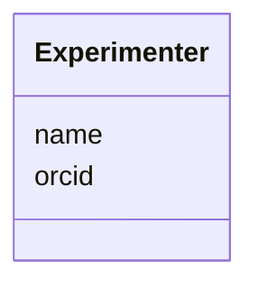

# Class: Experimenter


_The person that performed the experiment or developed the protocol_


URI: [https://github.com/MontpellierRessourcesImagerie/microscope-metrics/blob/main/src/microscopemetrics/data_schema/core_schema.yaml/:Experimenter](https://github.com/MontpellierRessourcesImagerie/microscope-metrics/blob/main/src/microscopemetrics/data_schema/core_schema.yaml/:Experimenter)





<!-- no inheritance hierarchy -->


## Slots

| Name | Cardinality and Range | Description | Inheritance |
| ---  | --- | --- | --- |
| [name](name.md) | 1..1 <br/> [String](String.md) | The name of the experimenter | direct |
| [orcid](orcid.md) | 1..1 <br/> [String](String.md) | The ORCID of the experimenter | direct |


## Usages

| used by | used in | type | used |
| ---  | --- | --- | --- |
| [Protocol](Protocol.md) | [authors](authors.md) | range | [Experimenter](Experimenter.md) |
| [MetricsDataset](MetricsDataset.md) | [experimenter](experimenter.md) | range | [Experimenter](Experimenter.md) |


## Identifier and Mapping Information


### Schema Source


* from schema: https://github.com/MontpellierRessourcesImagerie/microscope-metrics/blob/main/src/microscopemetrics/data_schema/core_schema.yaml


## Mappings

| Mapping Type | Mapped Value |
| ---  | ---  |
| self | https://github.com/MontpellierRessourcesImagerie/microscope-metrics/blob/main/src/microscopemetrics/data_schema/core_schema.yaml/:Experimenter |
| native | https://github.com/MontpellierRessourcesImagerie/microscope-metrics/blob/main/src/microscopemetrics/data_schema/core_schema.yaml/:Experimenter |


## LinkML Source

<!-- TODO: investigate https://stackoverflow.com/questions/37606292/how-to-create-tabbed-code-blocks-in-mkdocs-or-sphinx -->

### Direct

<details>
```yaml
name: Experimenter
description: The person that performed the experiment or developed the protocol
from_schema: https://github.com/MontpellierRessourcesImagerie/microscope-metrics/blob/main/src/microscopemetrics/data_schema/core_schema.yaml
attributes:
  name:
    name: name
    description: The name of the experimenter
    from_schema: https://github.com/MontpellierRessourcesImagerie/microscope-metrics/blob/main/src/microscopemetrics/data_schema/core_schema.yaml
    range: string
    required: true
  orcid:
    name: orcid
    description: The ORCID of the experimenter
    from_schema: https://github.com/MontpellierRessourcesImagerie/microscope-metrics/blob/main/src/microscopemetrics/data_schema/core_schema.yaml
    rank: 1000
    identifier: true
    range: string
    required: true

```
</details>

### Induced

<details>
```yaml
name: Experimenter
description: The person that performed the experiment or developed the protocol
from_schema: https://github.com/MontpellierRessourcesImagerie/microscope-metrics/blob/main/src/microscopemetrics/data_schema/core_schema.yaml
attributes:
  name:
    name: name
    description: The name of the experimenter
    from_schema: https://github.com/MontpellierRessourcesImagerie/microscope-metrics/blob/main/src/microscopemetrics/data_schema/core_schema.yaml
    alias: name
    owner: Experimenter
    domain_of:
    - NamedObject
    - Experimenter
    - Column
    range: string
    required: true
  orcid:
    name: orcid
    description: The ORCID of the experimenter
    from_schema: https://github.com/MontpellierRessourcesImagerie/microscope-metrics/blob/main/src/microscopemetrics/data_schema/core_schema.yaml
    rank: 1000
    identifier: true
    alias: orcid
    owner: Experimenter
    domain_of:
    - Experimenter
    range: string
    required: true

```
</details>