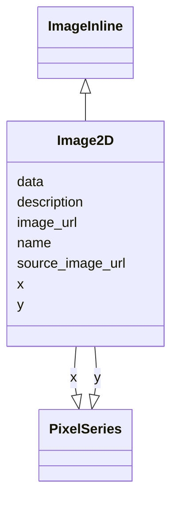

# Class: Image2D


_A 2D image in YX order_


URI: [https://github.com/MontpellierRessourcesImagerie/microscope-metrics/blob/main/src/microscopemetrics/data_schema/core_schema.yaml/:Image2D](https://github.com/MontpellierRessourcesImagerie/microscope-metrics/blob/main/src/microscopemetrics/data_schema/core_schema.yaml/:Image2D)





## Inheritance
* [NamedObject](NamedObject.md)
    * [MetricsObject](MetricsObject.md)
        * [Image](Image.md)
            * [ImageInline](ImageInline.md)
                * **Image2D**


## Slots

| Name | Cardinality and Range | Description | Inheritance |
| ---  | --- | --- | --- |
| [y](y.md) | 1..1 <br/> [PixelSeries](PixelSeries.md) |  | direct |
| [x](x.md) | 1..1 <br/> [PixelSeries](PixelSeries.md) |  | direct |
| [data](data.md) | 1..* <br/> [Float](Float.md) |  | direct |
| [image_url](image_url.md) | 1..1 <br/> [String](String.md) | An URL linking to the image | [Image](Image.md) |
| [source_image_url](source_image_url.md) | 0..* <br/> [String](String.md) | A list of URLs linking to the images that were used as a source | [Image](Image.md) |
| [name](name.md) | 0..1 <br/> [String](String.md) | The name of an entity | [NamedObject](NamedObject.md) |
| [description](description.md) | 0..1 <br/> [String](String.md) | A description of an entity | [NamedObject](NamedObject.md) |


## Identifier and Mapping Information


### Schema Source


* from schema: https://github.com/MontpellierRessourcesImagerie/microscope-metrics/blob/main/src/microscopemetrics/data_schema/core_schema.yaml


## Mappings

| Mapping Type | Mapped Value |
| ---  | ---  |
| self | https://github.com/MontpellierRessourcesImagerie/microscope-metrics/blob/main/src/microscopemetrics/data_schema/core_schema.yaml/:Image2D |
| native | https://github.com/MontpellierRessourcesImagerie/microscope-metrics/blob/main/src/microscopemetrics/data_schema/core_schema.yaml/:Image2D |


## LinkML Source

<!-- TODO: investigate https://stackoverflow.com/questions/37606292/how-to-create-tabbed-code-blocks-in-mkdocs-or-sphinx -->

### Direct

<details>
```yaml
name: Image2D
implements:
- linkml:TwoDimensionalArray
- linkml:RowOrderedArray
description: A 2D image in YX order
from_schema: https://github.com/MontpellierRessourcesImagerie/microscope-metrics/blob/main/src/microscopemetrics/data_schema/core_schema.yaml
is_a: ImageInline
attributes:
  y:
    name: y
    implements:
    - linkml:axis0
    from_schema: https://github.com/MontpellierRessourcesImagerie/microscope-metrics/blob/main/src/microscopemetrics/data_schema/core_schema.yaml
    range: PixelSeries
    required: true
  x:
    name: x
    implements:
    - linkml:axis1
    from_schema: https://github.com/MontpellierRessourcesImagerie/microscope-metrics/blob/main/src/microscopemetrics/data_schema/core_schema.yaml
    range: PixelSeries
    required: true
  data:
    name: data
    implements:
    - linkml:elements
    from_schema: https://github.com/MontpellierRessourcesImagerie/microscope-metrics/blob/main/src/microscopemetrics/data_schema/core_schema.yaml
    multivalued: true
    range: float
    required: true

```
</details>

### Induced

<details>
```yaml
name: Image2D
implements:
- linkml:TwoDimensionalArray
- linkml:RowOrderedArray
description: A 2D image in YX order
from_schema: https://github.com/MontpellierRessourcesImagerie/microscope-metrics/blob/main/src/microscopemetrics/data_schema/core_schema.yaml
is_a: ImageInline
attributes:
  y:
    name: y
    implements:
    - linkml:axis0
    from_schema: https://github.com/MontpellierRessourcesImagerie/microscope-metrics/blob/main/src/microscopemetrics/data_schema/core_schema.yaml
    alias: y
    owner: Image2D
    domain_of:
    - ImageMask
    - Image2D
    - Image5D
    - Point
    - Rectangle
    - Ellipse
    - Vertex
    - Mask
    range: PixelSeries
    required: true
  x:
    name: x
    implements:
    - linkml:axis1
    from_schema: https://github.com/MontpellierRessourcesImagerie/microscope-metrics/blob/main/src/microscopemetrics/data_schema/core_schema.yaml
    alias: x
    owner: Image2D
    domain_of:
    - ImageMask
    - Image2D
    - Image5D
    - Point
    - Rectangle
    - Ellipse
    - Vertex
    - Mask
    range: PixelSeries
    required: true
  data:
    name: data
    implements:
    - linkml:elements
    from_schema: https://github.com/MontpellierRessourcesImagerie/microscope-metrics/blob/main/src/microscopemetrics/data_schema/core_schema.yaml
    multivalued: true
    alias: data
    owner: Image2D
    domain_of:
    - ImageAsNumpy
    - ImageMask
    - Image2D
    - Image5D
    range: float
    required: true
  image_url:
    name: image_url
    description: An URL linking to the image
    from_schema: https://github.com/MontpellierRessourcesImagerie/microscope-metrics/blob/main/src/microscopemetrics/data_schema/core_schema.yaml
    rank: 1000
    multivalued: false
    identifier: true
    alias: image_url
    owner: Image2D
    domain_of:
    - Image
    range: string
    required: true
  source_image_url:
    name: source_image_url
    description: A list of URLs linking to the images that were used as a source
    from_schema: https://github.com/MontpellierRessourcesImagerie/microscope-metrics/blob/main/src/microscopemetrics/data_schema/core_schema.yaml
    rank: 1000
    multivalued: true
    alias: source_image_url
    owner: Image2D
    domain_of:
    - Image
    range: string
    required: false
  name:
    name: name
    description: The name of an entity
    from_schema: https://github.com/MontpellierRessourcesImagerie/microscope-metrics/blob/main/src/microscopemetrics/data_schema/core_schema.yaml
    rank: 1000
    multivalued: false
    alias: name
    owner: Image2D
    domain_of:
    - NamedObject
    - Experimenter
    - Column
    range: string
    required: false
  description:
    name: description
    description: A description of an entity
    from_schema: https://github.com/MontpellierRessourcesImagerie/microscope-metrics/blob/main/src/microscopemetrics/data_schema/core_schema.yaml
    rank: 1000
    multivalued: false
    alias: description
    owner: Image2D
    domain_of:
    - NamedObject
    - ROI
    - Tag
    range: string

```
</details>