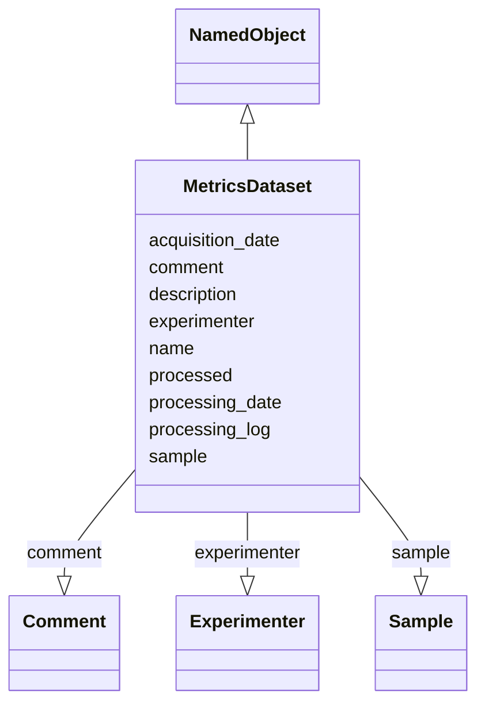

# Class: MetricsDataset


_A base object on which microscope-metrics runs the analysis_


URI: [https://github.com/MontpellierRessourcesImagerie/microscope-metrics/blob/main/src/microscopemetrics/data_schema/core_schema.yaml/:MetricsDataset](https://github.com/MontpellierRessourcesImagerie/microscope-metrics/blob/main/src/microscopemetrics/data_schema/core_schema.yaml/:MetricsDataset)





## Inheritance
* [NamedObject](NamedObject.md)
    * **MetricsDataset**


## Slots

| Name | Cardinality and Range | Description | Inheritance |
| ---  | --- | --- | --- |
| [sample](sample.md) | 0..1 <br/> [Sample](Sample.md) | The sample that was imaged | direct |
| [experimenter](experimenter.md) | 0..* <br/> [Experimenter](Experimenter.md) | The experimenter that performed the imaging experiment | direct |
| [acquisition_date](acquisition_date.md) | 0..1 <br/> [Date](Date.md) | The date of the acquisition | direct |
| [processed](processed.md) | 1..1 <br/> [Boolean](Boolean.md) | Has the dataset been processed by microscope-metrics | direct |
| [processing_date](processing_date.md) | 0..1 <br/> [Date](Date.md) | The date of the processing by microscope-metrics | direct |
| [processing_log](processing_log.md) | 0..1 <br/> [String](String.md) | The log of the processing by microscope-metrics | direct |
| [comment](comment.md) | 0..* <br/> [Comment](Comment.md) | A human readable comment about the dataset | direct |
| [name](name.md) | 0..1 <br/> [String](String.md) | The name of an entity | [NamedObject](NamedObject.md) |
| [description](description.md) | 0..1 <br/> [String](String.md) | A description of an entity | [NamedObject](NamedObject.md) |


## Identifier and Mapping Information


### Schema Source


* from schema: https://github.com/MontpellierRessourcesImagerie/microscope-metrics/blob/main/src/microscopemetrics/data_schema/core_schema.yaml


## Mappings

| Mapping Type | Mapped Value |
| ---  | ---  |
| self | https://github.com/MontpellierRessourcesImagerie/microscope-metrics/blob/main/src/microscopemetrics/data_schema/core_schema.yaml/:MetricsDataset |
| native | https://github.com/MontpellierRessourcesImagerie/microscope-metrics/blob/main/src/microscopemetrics/data_schema/core_schema.yaml/:MetricsDataset |


## LinkML Source

<!-- TODO: investigate https://stackoverflow.com/questions/37606292/how-to-create-tabbed-code-blocks-in-mkdocs-or-sphinx -->

### Direct

<details>
```yaml
name: MetricsDataset
description: A base object on which microscope-metrics runs the analysis
from_schema: https://github.com/MontpellierRessourcesImagerie/microscope-metrics/blob/main/src/microscopemetrics/data_schema/core_schema.yaml
is_a: NamedObject
attributes:
  sample:
    name: sample
    description: The sample that was imaged
    from_schema: https://github.com/MontpellierRessourcesImagerie/microscope-metrics/blob/main/src/microscopemetrics/data_schema/core_schema.yaml
    rank: 1000
    multivalued: false
    range: Sample
    inlined: false
  experimenter:
    name: experimenter
    description: The experimenter that performed the imaging experiment
    from_schema: https://github.com/MontpellierRessourcesImagerie/microscope-metrics/blob/main/src/microscopemetrics/data_schema/core_schema.yaml
    rank: 1000
    multivalued: true
    range: Experimenter
  acquisition_date:
    name: acquisition_date
    description: The date of the acquisition
    from_schema: https://github.com/MontpellierRessourcesImagerie/microscope-metrics/blob/main/src/microscopemetrics/data_schema/core_schema.yaml
    rank: 1000
    multivalued: false
    range: date
  processed:
    name: processed
    description: Has the dataset been processed by microscope-metrics
    from_schema: https://github.com/MontpellierRessourcesImagerie/microscope-metrics/blob/main/src/microscopemetrics/data_schema/core_schema.yaml
    rank: 1000
    multivalued: false
    ifabsent: 'False'
    range: boolean
    required: true
  processing_date:
    name: processing_date
    description: The date of the processing by microscope-metrics
    from_schema: https://github.com/MontpellierRessourcesImagerie/microscope-metrics/blob/main/src/microscopemetrics/data_schema/core_schema.yaml
    rank: 1000
    multivalued: false
    range: date
  processing_log:
    name: processing_log
    description: The log of the processing by microscope-metrics
    from_schema: https://github.com/MontpellierRessourcesImagerie/microscope-metrics/blob/main/src/microscopemetrics/data_schema/core_schema.yaml
    rank: 1000
    multivalued: false
    range: string
  comment:
    name: comment
    description: A human readable comment about the dataset
    from_schema: https://github.com/MontpellierRessourcesImagerie/microscope-metrics/blob/main/src/microscopemetrics/data_schema/core_schema.yaml
    rank: 1000
    multivalued: true
    range: Comment
    required: false
tree_root: true

```
</details>

### Induced

<details>
```yaml
name: MetricsDataset
description: A base object on which microscope-metrics runs the analysis
from_schema: https://github.com/MontpellierRessourcesImagerie/microscope-metrics/blob/main/src/microscopemetrics/data_schema/core_schema.yaml
is_a: NamedObject
attributes:
  sample:
    name: sample
    description: The sample that was imaged
    from_schema: https://github.com/MontpellierRessourcesImagerie/microscope-metrics/blob/main/src/microscopemetrics/data_schema/core_schema.yaml
    rank: 1000
    multivalued: false
    alias: sample
    owner: MetricsDataset
    domain_of:
    - MetricsDataset
    range: Sample
    inlined: false
  experimenter:
    name: experimenter
    description: The experimenter that performed the imaging experiment
    from_schema: https://github.com/MontpellierRessourcesImagerie/microscope-metrics/blob/main/src/microscopemetrics/data_schema/core_schema.yaml
    rank: 1000
    multivalued: true
    alias: experimenter
    owner: MetricsDataset
    domain_of:
    - MetricsDataset
    range: Experimenter
  acquisition_date:
    name: acquisition_date
    description: The date of the acquisition
    from_schema: https://github.com/MontpellierRessourcesImagerie/microscope-metrics/blob/main/src/microscopemetrics/data_schema/core_schema.yaml
    rank: 1000
    multivalued: false
    alias: acquisition_date
    owner: MetricsDataset
    domain_of:
    - MetricsDataset
    range: date
  processed:
    name: processed
    description: Has the dataset been processed by microscope-metrics
    from_schema: https://github.com/MontpellierRessourcesImagerie/microscope-metrics/blob/main/src/microscopemetrics/data_schema/core_schema.yaml
    rank: 1000
    multivalued: false
    ifabsent: 'False'
    alias: processed
    owner: MetricsDataset
    domain_of:
    - MetricsDataset
    range: boolean
    required: true
  processing_date:
    name: processing_date
    description: The date of the processing by microscope-metrics
    from_schema: https://github.com/MontpellierRessourcesImagerie/microscope-metrics/blob/main/src/microscopemetrics/data_schema/core_schema.yaml
    rank: 1000
    multivalued: false
    alias: processing_date
    owner: MetricsDataset
    domain_of:
    - MetricsDataset
    range: date
  processing_log:
    name: processing_log
    description: The log of the processing by microscope-metrics
    from_schema: https://github.com/MontpellierRessourcesImagerie/microscope-metrics/blob/main/src/microscopemetrics/data_schema/core_schema.yaml
    rank: 1000
    multivalued: false
    alias: processing_log
    owner: MetricsDataset
    domain_of:
    - MetricsDataset
    range: string
  comment:
    name: comment
    description: A human readable comment about the dataset
    from_schema: https://github.com/MontpellierRessourcesImagerie/microscope-metrics/blob/main/src/microscopemetrics/data_schema/core_schema.yaml
    rank: 1000
    multivalued: true
    alias: comment
    owner: MetricsDataset
    domain_of:
    - MetricsDataset
    range: Comment
    required: false
  name:
    name: name
    description: The name of an entity
    from_schema: https://github.com/MontpellierRessourcesImagerie/microscope-metrics/blob/main/src/microscopemetrics/data_schema/core_schema.yaml
    rank: 1000
    multivalued: false
    alias: name
    owner: MetricsDataset
    domain_of:
    - NamedObject
    - Experimenter
    - Column
    range: string
    required: false
  description:
    name: description
    description: A description of an entity
    from_schema: https://github.com/MontpellierRessourcesImagerie/microscope-metrics/blob/main/src/microscopemetrics/data_schema/core_schema.yaml
    rank: 1000
    multivalued: false
    alias: description
    owner: MetricsDataset
    domain_of:
    - NamedObject
    - Roi
    - Tag
    range: string
tree_root: true

```
</details>