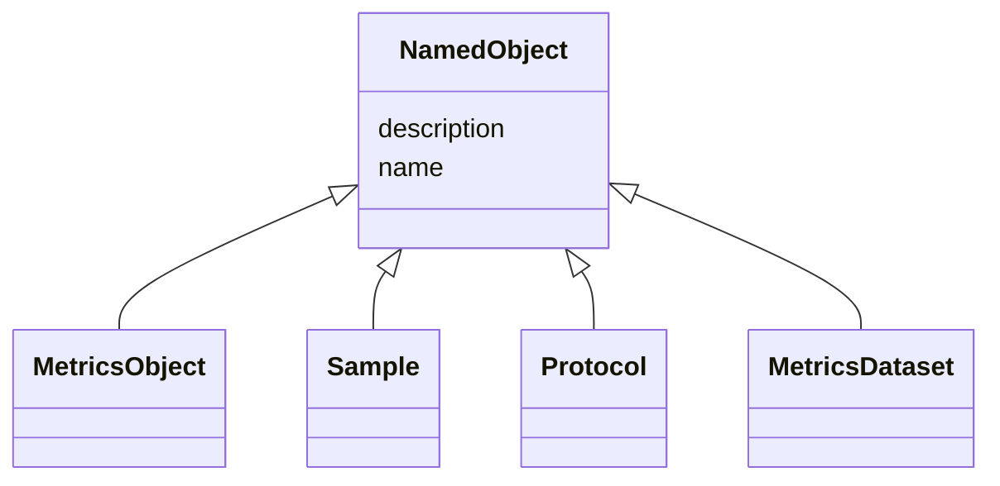

# Class: NamedObject


_An object with a name and a description_


* __NOTE__: this is an abstract class and should not be instantiated directly


URI: [https://github.com/MontpellierRessourcesImagerie/microscope-metrics/blob/main/src/microscopemetrics/data_schema/core_schema.yaml/:NamedObject](https://github.com/MontpellierRessourcesImagerie/microscope-metrics/blob/main/src/microscopemetrics/data_schema/core_schema.yaml/:NamedObject)





## Inheritance
* **NamedObject**
    * [MetricsObject](MetricsObject.md)
    * [Sample](Sample.md)
    * [Protocol](Protocol.md)
    * [MetricsDataset](MetricsDataset.md)


## Slots

| Name | Cardinality and Range | Description | Inheritance |
| ---  | --- | --- | --- |
| [name](name.md) | 0..1 <br/> [String](String.md) | The name of an entity | direct |
| [description](description.md) | 0..1 <br/> [String](String.md) | A description of an entity | direct |


## Identifier and Mapping Information


### Schema Source


* from schema: https://github.com/MontpellierRessourcesImagerie/microscope-metrics/blob/main/src/microscopemetrics/data_schema/core_schema.yaml


## Mappings

| Mapping Type | Mapped Value |
| ---  | ---  |
| self | https://github.com/MontpellierRessourcesImagerie/microscope-metrics/blob/main/src/microscopemetrics/data_schema/core_schema.yaml/:NamedObject |
| native | https://github.com/MontpellierRessourcesImagerie/microscope-metrics/blob/main/src/microscopemetrics/data_schema/core_schema.yaml/:NamedObject |


## LinkML Source

<!-- TODO: investigate https://stackoverflow.com/questions/37606292/how-to-create-tabbed-code-blocks-in-mkdocs-or-sphinx -->

### Direct

<details>
```yaml
name: NamedObject
description: An object with a name and a description
from_schema: https://github.com/MontpellierRessourcesImagerie/microscope-metrics/blob/main/src/microscopemetrics/data_schema/core_schema.yaml
abstract: true
slots:
- name
- description

```
</details>

### Induced

<details>
```yaml
name: NamedObject
description: An object with a name and a description
from_schema: https://github.com/MontpellierRessourcesImagerie/microscope-metrics/blob/main/src/microscopemetrics/data_schema/core_schema.yaml
abstract: true
attributes:
  name:
    name: name
    description: The name of an entity
    from_schema: https://github.com/MontpellierRessourcesImagerie/microscope-metrics/blob/main/src/microscopemetrics/data_schema/core_schema.yaml
    rank: 1000
    multivalued: false
    alias: name
    owner: NamedObject
    domain_of:
    - NamedObject
    - Experimenter
    - Column
    range: string
    required: false
  description:
    name: description
    description: A description of an entity
    from_schema: https://github.com/MontpellierRessourcesImagerie/microscope-metrics/blob/main/src/microscopemetrics/data_schema/core_schema.yaml
    rank: 1000
    multivalued: false
    alias: description
    owner: NamedObject
    domain_of:
    - NamedObject
    - roi
    - Tag
    range: string

```
</details>