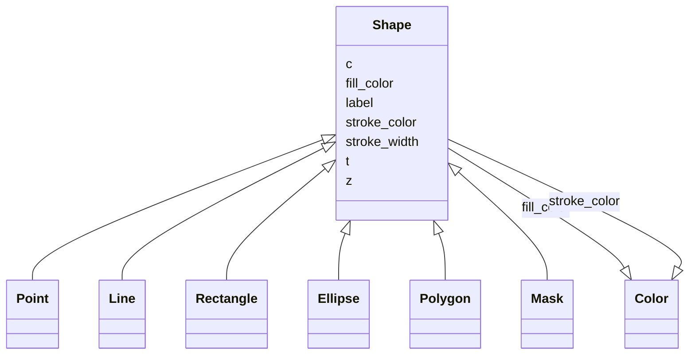

# Class: Shape


_A shape_


* __NOTE__: this is an abstract class and should not be instantiated directly


URI: [https://github.com/MontpellierRessourcesImagerie/microscope-metrics/blob/main/src/microscopemetrics/data_schema/core_schema.yaml/:Shape](https://github.com/MontpellierRessourcesImagerie/microscope-metrics/blob/main/src/microscopemetrics/data_schema/core_schema.yaml/:Shape)





## Inheritance
* **Shape**
    * [Point](Point.md)
    * [Line](Line.md)
    * [Rectangle](Rectangle.md)
    * [Ellipse](Ellipse.md)
    * [Polygon](Polygon.md)
    * [Mask](Mask.md)


## Slots

| Name | Cardinality and Range | Description | Inheritance |
| ---  | --- | --- | --- |
| [label](label.md) | 0..1 <br/> [String](String.md) | The label of the shape | direct |
| [z](z.md) | 0..1 <br/> [Float](Float.md) | The z coordinate of the shape | direct |
| [c](c.md) | 0..1 <br/> [Integer](Integer.md) | The c coordinate of the shape | direct |
| [t](t.md) | 0..1 <br/> [Integer](Integer.md) | The t coordinate of the shape | direct |
| [fill_color](fill_color.md) | 0..1 <br/> [Color](Color.md) | The fill color of the shape | direct |
| [stroke_color](stroke_color.md) | 0..1 <br/> [Color](Color.md) | The stroke color of the shape | direct |
| [stroke_width](stroke_width.md) | 0..1 <br/> [Integer](Integer.md) | The stroke width of the shape | direct |


## Usages

| used by | used in | type | used |
| ---  | --- | --- | --- |
| [Roi](Roi.md) | [shapes](shapes.md) | range | [Shape](Shape.md) |


## Identifier and Mapping Information


### Schema Source


* from schema: https://github.com/MontpellierRessourcesImagerie/microscope-metrics/blob/main/src/microscopemetrics/data_schema/core_schema.yaml


## Mappings

| Mapping Type | Mapped Value |
| ---  | ---  |
| self | https://github.com/MontpellierRessourcesImagerie/microscope-metrics/blob/main/src/microscopemetrics/data_schema/core_schema.yaml/:Shape |
| native | https://github.com/MontpellierRessourcesImagerie/microscope-metrics/blob/main/src/microscopemetrics/data_schema/core_schema.yaml/:Shape |


## LinkML Source

<!-- TODO: investigate https://stackoverflow.com/questions/37606292/how-to-create-tabbed-code-blocks-in-mkdocs-or-sphinx -->

### Direct

<details>
```yaml
name: Shape
description: A shape
from_schema: https://github.com/MontpellierRessourcesImagerie/microscope-metrics/blob/main/src/microscopemetrics/data_schema/core_schema.yaml
abstract: true
attributes:
  label:
    name: label
    description: The label of the shape
    from_schema: https://github.com/MontpellierRessourcesImagerie/microscope-metrics/blob/main/src/microscopemetrics/data_schema/core_schema.yaml
    range: string
    required: false
  z:
    name: z
    description: The z coordinate of the shape
    from_schema: https://github.com/MontpellierRessourcesImagerie/microscope-metrics/blob/main/src/microscopemetrics/data_schema/core_schema.yaml
    range: float
    required: false
  c:
    name: c
    description: The c coordinate of the shape
    from_schema: https://github.com/MontpellierRessourcesImagerie/microscope-metrics/blob/main/src/microscopemetrics/data_schema/core_schema.yaml
    range: integer
    required: false
  t:
    name: t
    description: The t coordinate of the shape
    from_schema: https://github.com/MontpellierRessourcesImagerie/microscope-metrics/blob/main/src/microscopemetrics/data_schema/core_schema.yaml
    range: integer
    required: false
  fill_color:
    name: fill_color
    description: The fill color of the shape
    from_schema: https://github.com/MontpellierRessourcesImagerie/microscope-metrics/blob/main/src/microscopemetrics/data_schema/core_schema.yaml
    rank: 1000
    range: Color
    required: false
  stroke_color:
    name: stroke_color
    description: The stroke color of the shape
    from_schema: https://github.com/MontpellierRessourcesImagerie/microscope-metrics/blob/main/src/microscopemetrics/data_schema/core_schema.yaml
    rank: 1000
    range: Color
    required: false
  stroke_width:
    name: stroke_width
    description: The stroke width of the shape
    from_schema: https://github.com/MontpellierRessourcesImagerie/microscope-metrics/blob/main/src/microscopemetrics/data_schema/core_schema.yaml
    rank: 1000
    ifabsent: int(1)
    range: integer
    required: false

```
</details>

### Induced

<details>
```yaml
name: Shape
description: A shape
from_schema: https://github.com/MontpellierRessourcesImagerie/microscope-metrics/blob/main/src/microscopemetrics/data_schema/core_schema.yaml
abstract: true
attributes:
  label:
    name: label
    description: The label of the shape
    from_schema: https://github.com/MontpellierRessourcesImagerie/microscope-metrics/blob/main/src/microscopemetrics/data_schema/core_schema.yaml
    alias: label
    owner: Shape
    domain_of:
    - Roi
    - Shape
    range: string
    required: false
  z:
    name: z
    description: The z coordinate of the shape
    from_schema: https://github.com/MontpellierRessourcesImagerie/microscope-metrics/blob/main/src/microscopemetrics/data_schema/core_schema.yaml
    alias: z
    owner: Shape
    domain_of:
    - Image5D
    - Shape
    range: float
    required: false
  c:
    name: c
    description: The c coordinate of the shape
    from_schema: https://github.com/MontpellierRessourcesImagerie/microscope-metrics/blob/main/src/microscopemetrics/data_schema/core_schema.yaml
    alias: c
    owner: Shape
    domain_of:
    - Image5D
    - Shape
    range: integer
    required: false
  t:
    name: t
    description: The t coordinate of the shape
    from_schema: https://github.com/MontpellierRessourcesImagerie/microscope-metrics/blob/main/src/microscopemetrics/data_schema/core_schema.yaml
    alias: t
    owner: Shape
    domain_of:
    - Image5D
    - Shape
    range: integer
    required: false
  fill_color:
    name: fill_color
    description: The fill color of the shape
    from_schema: https://github.com/MontpellierRessourcesImagerie/microscope-metrics/blob/main/src/microscopemetrics/data_schema/core_schema.yaml
    rank: 1000
    alias: fill_color
    owner: Shape
    domain_of:
    - Shape
    range: Color
    required: false
  stroke_color:
    name: stroke_color
    description: The stroke color of the shape
    from_schema: https://github.com/MontpellierRessourcesImagerie/microscope-metrics/blob/main/src/microscopemetrics/data_schema/core_schema.yaml
    rank: 1000
    alias: stroke_color
    owner: Shape
    domain_of:
    - Shape
    range: Color
    required: false
  stroke_width:
    name: stroke_width
    description: The stroke width of the shape
    from_schema: https://github.com/MontpellierRessourcesImagerie/microscope-metrics/blob/main/src/microscopemetrics/data_schema/core_schema.yaml
    rank: 1000
    ifabsent: int(1)
    alias: stroke_width
    owner: Shape
    domain_of:
    - Shape
    range: integer
    required: false

```
</details>