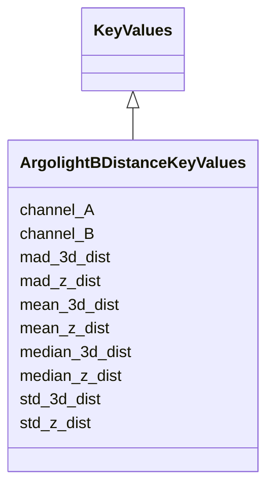

# Class: ArgolightBDistanceKeyValues


URI: [https://github.com/MontpellierRessourcesImagerie/microscope-metrics/blob/main/src/microscopemetrics/data_schema/samples/argolight_schema.yaml/:ArgolightBDistanceKeyValues](https://github.com/MontpellierRessourcesImagerie/microscope-metrics/blob/main/src/microscopemetrics/data_schema/samples/argolight_schema.yaml/:ArgolightBDistanceKeyValues)





## Inheritance
* [KeyValues](KeyValues.md)
    * **ArgolightBDistanceKeyValues**


## Slots

| Name | Cardinality and Range | Description | Inheritance |
| ---  | --- | --- | --- |
| [channel_A](channel_A.md) | 0..* <br/> [Integer](Integer.md) | The first channel number to which the measurements apply | direct |
| [channel_B](channel_B.md) | 0..* <br/> [Integer](Integer.md) | The second channel number to which the measurements apply | direct |
| [mean_3d_dist](mean_3d_dist.md) | 0..* <br/> [Float](Float.md) | Mean of the 3D distances between spots for each permutation of channel A and ... | direct |
| [median_3d_dist](median_3d_dist.md) | 0..* <br/> [Float](Float.md) | Median of the 3D distances between spots for each permutation of channel A an... | direct |
| [std_3d_dist](std_3d_dist.md) | 0..* <br/> [Float](Float.md) | Standard deviation of the 3D distances between spots for each permutation of ... | direct |
| [mad_3d_dist](mad_3d_dist.md) | 0..* <br/> [Float](Float.md) | Median absolute deviation of the 3D distances between spots for each permutat... | direct |
| [mean_z_dist](mean_z_dist.md) | 0..* <br/> [Float](Float.md) | Mean of the Z distances between spots for each permutation of channel A and B | direct |
| [median_z_dist](median_z_dist.md) | 0..* <br/> [Float](Float.md) | Median of the Z distances between spots for each permutation of channel A and... | direct |
| [std_z_dist](std_z_dist.md) | 0..* <br/> [Float](Float.md) | Standard deviation of the Z distances between spots for each permutation of c... | direct |
| [mad_z_dist](mad_z_dist.md) | 0..* <br/> [Float](Float.md) | Median absolute deviation of the Z distances between spots for each permutati... | direct |


## Usages

| used by | used in | type | used |
| ---  | --- | --- | --- |
| [ArgolightBOutput](ArgolightBOutput.md) | [distance_measurements](distance_measurements.md) | range | [ArgolightBDistanceKeyValues](ArgolightBDistanceKeyValues.md) |


## Identifier and Mapping Information


### Schema Source


* from schema: https://github.com/MontpellierRessourcesImagerie/microscope-metrics/blob/main/src/microscopemetrics/data_schema/samples/argolight_schema.yaml


## Mappings

| Mapping Type | Mapped Value |
| ---  | ---  |
| self | https://github.com/MontpellierRessourcesImagerie/microscope-metrics/blob/main/src/microscopemetrics/data_schema/samples/argolight_schema.yaml/:ArgolightBDistanceKeyValues |
| native | https://github.com/MontpellierRessourcesImagerie/microscope-metrics/blob/main/src/microscopemetrics/data_schema/samples/argolight_schema.yaml/:ArgolightBDistanceKeyValues |


## LinkML Source

<!-- TODO: investigate https://stackoverflow.com/questions/37606292/how-to-create-tabbed-code-blocks-in-mkdocs-or-sphinx -->

### Direct

<details>
```yaml
name: ArgolightBDistanceKeyValues
from_schema: https://github.com/MontpellierRessourcesImagerie/microscope-metrics/blob/main/src/microscopemetrics/data_schema/samples/argolight_schema.yaml
is_a: KeyValues
slots:
- channel_A
- channel_B
- mean_3d_dist
- median_3d_dist
- std_3d_dist
- mad_3d_dist
- mean_z_dist
- median_z_dist
- std_z_dist
- mad_z_dist

```
</details>

### Induced

<details>
```yaml
name: ArgolightBDistanceKeyValues
from_schema: https://github.com/MontpellierRessourcesImagerie/microscope-metrics/blob/main/src/microscopemetrics/data_schema/samples/argolight_schema.yaml
is_a: KeyValues
attributes:
  channel_A:
    name: channel_A
    description: The first channel number to which the measurements apply
    from_schema: https://github.com/MontpellierRessourcesImagerie/microscope-metrics/blob/main/src/microscopemetrics/data_schema/samples/argolight_schema.yaml
    rank: 1000
    is_a: channel
    multivalued: true
    alias: channel_A
    owner: ArgolightBDistanceKeyValues
    domain_of:
    - ArgolightBDistanceKeyValues
    range: integer
  channel_B:
    name: channel_B
    description: The second channel number to which the measurements apply
    from_schema: https://github.com/MontpellierRessourcesImagerie/microscope-metrics/blob/main/src/microscopemetrics/data_schema/samples/argolight_schema.yaml
    rank: 1000
    is_a: channel
    multivalued: true
    alias: channel_B
    owner: ArgolightBDistanceKeyValues
    domain_of:
    - ArgolightBDistanceKeyValues
    range: integer
  mean_3d_dist:
    name: mean_3d_dist
    description: Mean of the 3D distances between spots for each permutation of channel
      A and B
    from_schema: https://github.com/MontpellierRessourcesImagerie/microscope-metrics/blob/main/src/microscopemetrics/data_schema/samples/argolight_schema.yaml
    rank: 1000
    multivalued: true
    alias: mean_3d_dist
    owner: ArgolightBDistanceKeyValues
    domain_of:
    - ArgolightBDistanceKeyValues
    range: float
  median_3d_dist:
    name: median_3d_dist
    description: Median of the 3D distances between spots for each permutation of
      channel A and B
    from_schema: https://github.com/MontpellierRessourcesImagerie/microscope-metrics/blob/main/src/microscopemetrics/data_schema/samples/argolight_schema.yaml
    rank: 1000
    multivalued: true
    alias: median_3d_dist
    owner: ArgolightBDistanceKeyValues
    domain_of:
    - ArgolightBDistanceKeyValues
    range: float
  std_3d_dist:
    name: std_3d_dist
    description: Standard deviation of the 3D distances between spots for each permutation
      of channel A and B
    from_schema: https://github.com/MontpellierRessourcesImagerie/microscope-metrics/blob/main/src/microscopemetrics/data_schema/samples/argolight_schema.yaml
    rank: 1000
    multivalued: true
    alias: std_3d_dist
    owner: ArgolightBDistanceKeyValues
    domain_of:
    - ArgolightBDistanceKeyValues
    range: float
  mad_3d_dist:
    name: mad_3d_dist
    description: Median absolute deviation of the 3D distances between spots for each
      permutation of channel A and B
    from_schema: https://github.com/MontpellierRessourcesImagerie/microscope-metrics/blob/main/src/microscopemetrics/data_schema/samples/argolight_schema.yaml
    rank: 1000
    multivalued: true
    alias: mad_3d_dist
    owner: ArgolightBDistanceKeyValues
    domain_of:
    - ArgolightBDistanceKeyValues
    range: float
  mean_z_dist:
    name: mean_z_dist
    description: Mean of the Z distances between spots for each permutation of channel
      A and B
    from_schema: https://github.com/MontpellierRessourcesImagerie/microscope-metrics/blob/main/src/microscopemetrics/data_schema/samples/argolight_schema.yaml
    rank: 1000
    multivalued: true
    alias: mean_z_dist
    owner: ArgolightBDistanceKeyValues
    domain_of:
    - ArgolightBDistanceKeyValues
    range: float
  median_z_dist:
    name: median_z_dist
    description: Median of the Z distances between spots for each permutation of channel
      A and B
    from_schema: https://github.com/MontpellierRessourcesImagerie/microscope-metrics/blob/main/src/microscopemetrics/data_schema/samples/argolight_schema.yaml
    rank: 1000
    multivalued: true
    alias: median_z_dist
    owner: ArgolightBDistanceKeyValues
    domain_of:
    - ArgolightBDistanceKeyValues
    range: float
  std_z_dist:
    name: std_z_dist
    description: Standard deviation of the Z distances between spots for each permutation
      of channel A and B
    from_schema: https://github.com/MontpellierRessourcesImagerie/microscope-metrics/blob/main/src/microscopemetrics/data_schema/samples/argolight_schema.yaml
    rank: 1000
    multivalued: true
    alias: std_z_dist
    owner: ArgolightBDistanceKeyValues
    domain_of:
    - ArgolightBDistanceKeyValues
    range: float
  mad_z_dist:
    name: mad_z_dist
    description: Median absolute deviation of the Z distances between spots for each
      permutation of channel A and B
    from_schema: https://github.com/MontpellierRessourcesImagerie/microscope-metrics/blob/main/src/microscopemetrics/data_schema/samples/argolight_schema.yaml
    rank: 1000
    multivalued: true
    alias: mad_z_dist
    owner: ArgolightBDistanceKeyValues
    domain_of:
    - ArgolightBDistanceKeyValues
    range: float

```
</details>