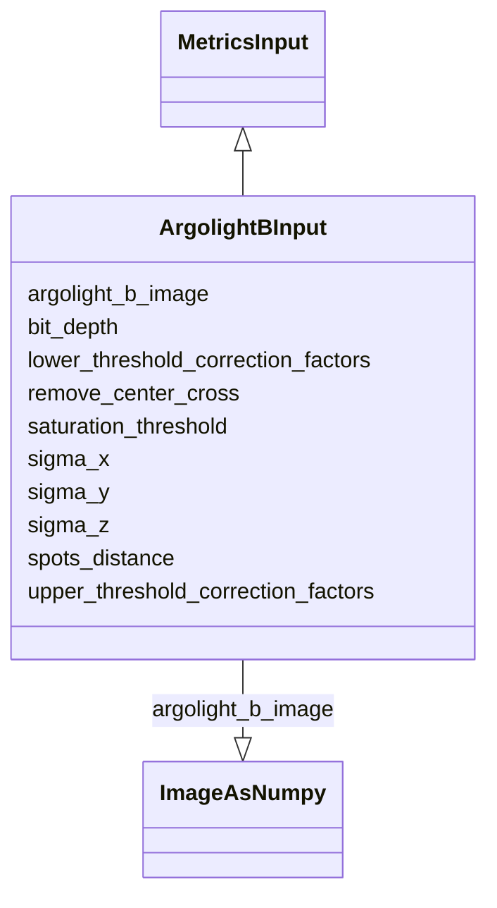

# Class: ArgolightBInput


URI: [https://github.com/MontpellierRessourcesImagerie/microscope-metrics/blob/main/src/microscopemetrics/data_schema/samples/argolight_schema.yaml/:ArgolightBInput](https://github.com/MontpellierRessourcesImagerie/microscope-metrics/blob/main/src/microscopemetrics/data_schema/samples/argolight_schema.yaml/:ArgolightBInput)





## Inheritance
* [MetricsInput](MetricsInput.md)
    * **ArgolightBInput**


## Slots

| Name | Cardinality and Range | Description | Inheritance |
| ---  | --- | --- | --- |
| [argolight_b_image](argolight_b_image.md) | 1..1 <br/> [ImageAsNumpy](ImageAsNumpy.md) | Input parameter: image of the argolight b pattern provided as a 5D numpy arra... | direct |
| [bit_depth](bit_depth.md) | 0..1 <br/> [Integer](Integer.md) | Detector bit depth | direct |
| [saturation_threshold](saturation_threshold.md) | 1..1 <br/> [Float](Float.md) | Tolerated saturation threshold | direct |
| [spots_distance](spots_distance.md) | 1..1 <br/> [Float](Float.md) | Input parameter: distance between argolight spots | direct |
| [sigma_z](sigma_z.md) | 1..1 <br/> [Float](Float.md) | Input parameter: smoothing factor for objects detection in the Z axis | direct |
| [sigma_y](sigma_y.md) | 1..1 <br/> [Float](Float.md) | Input parameter: smoothing factor for objects detection in the Y axis | direct |
| [sigma_x](sigma_x.md) | 1..1 <br/> [Float](Float.md) | Input parameter: smoothing factor for objects detection in the X axis | direct |
| [lower_threshold_correction_factors](lower_threshold_correction_factors.md) | 0..* <br/> [Float](Float.md) | Input parameter: correction factor for the lower thresholds | direct |
| [upper_threshold_correction_factors](upper_threshold_correction_factors.md) | 0..* <br/> [Float](Float.md) | Input parameter: correction factor for the upper thresholds | direct |
| [remove_center_cross](remove_center_cross.md) | 0..1 <br/> [Boolean](Boolean.md) | Input parameter: remove the center cross found in some Argolight patterns | direct |


## Usages

| used by | used in | type | used |
| ---  | --- | --- | --- |
| [ArgolightBDataset](ArgolightBDataset.md) | [input](input.md) | range | [ArgolightBInput](ArgolightBInput.md) |


## Identifier and Mapping Information


### Schema Source


* from schema: https://github.com/MontpellierRessourcesImagerie/microscope-metrics/blob/main/src/microscopemetrics/data_schema/samples/argolight_schema.yaml


## Mappings

| Mapping Type | Mapped Value |
| ---  | ---  |
| self | https://github.com/MontpellierRessourcesImagerie/microscope-metrics/blob/main/src/microscopemetrics/data_schema/samples/argolight_schema.yaml/:ArgolightBInput |
| native | https://github.com/MontpellierRessourcesImagerie/microscope-metrics/blob/main/src/microscopemetrics/data_schema/samples/argolight_schema.yaml/:ArgolightBInput |


## LinkML Source

<!-- TODO: investigate https://stackoverflow.com/questions/37606292/how-to-create-tabbed-code-blocks-in-mkdocs-or-sphinx -->

### Direct

<details>
```yaml
name: ArgolightBInput
from_schema: https://github.com/MontpellierRessourcesImagerie/microscope-metrics/blob/main/src/microscopemetrics/data_schema/samples/argolight_schema.yaml
is_a: MetricsInput
slots:
- argolight_b_image
- bit_depth
- saturation_threshold
- spots_distance
- sigma_z
- sigma_y
- sigma_x
- lower_threshold_correction_factors
- upper_threshold_correction_factors
- remove_center_cross
slot_usage:
  saturation_threshold:
    name: saturation_threshold
    domain_of:
    - ArgolightBInput
    - ArgolightEInput
    required: true

```
</details>

### Induced

<details>
```yaml
name: ArgolightBInput
from_schema: https://github.com/MontpellierRessourcesImagerie/microscope-metrics/blob/main/src/microscopemetrics/data_schema/samples/argolight_schema.yaml
is_a: MetricsInput
slot_usage:
  saturation_threshold:
    name: saturation_threshold
    domain_of:
    - ArgolightBInput
    - ArgolightEInput
    required: true
attributes:
  argolight_b_image:
    name: argolight_b_image
    description: 'Input parameter: image of the argolight b pattern provided as a
      5D numpy array in the order TZYXC'
    from_schema: https://github.com/MontpellierRessourcesImagerie/microscope-metrics/blob/main/src/microscopemetrics/data_schema/samples/argolight_schema.yaml
    rank: 1000
    multivalued: false
    alias: argolight_b_image
    owner: ArgolightBInput
    domain_of:
    - ArgolightBInput
    range: ImageAsNumpy
    required: true
    inlined: true
  bit_depth:
    name: bit_depth
    description: Detector bit depth
    from_schema: https://github.com/MontpellierRessourcesImagerie/microscope-metrics/blob/main/src/microscopemetrics/data_schema/samples/argolight_schema.yaml
    rank: 1000
    multivalued: false
    alias: bit_depth
    owner: ArgolightBInput
    domain_of:
    - ArgolightBInput
    - ArgolightEInput
    range: integer
    minimum_value: 1
    maximum_value: 64
  saturation_threshold:
    name: saturation_threshold
    description: Tolerated saturation threshold. If the amount of saturated pixels
      is above this threshold,  the image is considered as saturated and the analysis
      is not performed.
    from_schema: https://github.com/MontpellierRessourcesImagerie/microscope-metrics/blob/main/src/microscopemetrics/data_schema/samples/argolight_schema.yaml
    rank: 1000
    multivalued: false
    ifabsent: float(0.01)
    alias: saturation_threshold
    owner: ArgolightBInput
    domain_of:
    - ArgolightBInput
    - ArgolightEInput
    range: float
    required: true
    minimum_value: 0
    maximum_value: 1
  spots_distance:
    name: spots_distance
    description: 'Input parameter: distance between argolight spots'
    from_schema: https://github.com/MontpellierRessourcesImagerie/microscope-metrics/blob/main/src/microscopemetrics/data_schema/samples/argolight_schema.yaml
    rank: 1000
    multivalued: false
    alias: spots_distance
    owner: ArgolightBInput
    domain_of:
    - ArgolightBInput
    range: float
    required: true
  sigma_z:
    name: sigma_z
    description: 'Input parameter: smoothing factor for objects detection in the Z
      axis'
    from_schema: https://github.com/MontpellierRessourcesImagerie/microscope-metrics/blob/main/src/microscopemetrics/data_schema/samples/argolight_schema.yaml
    rank: 1000
    multivalued: false
    ifabsent: float(1.0)
    alias: sigma_z
    owner: ArgolightBInput
    domain_of:
    - ArgolightBInput
    range: float
    required: true
    minimum_value: 0
    maximum_value: 5
  sigma_y:
    name: sigma_y
    description: 'Input parameter: smoothing factor for objects detection in the Y
      axis'
    from_schema: https://github.com/MontpellierRessourcesImagerie/microscope-metrics/blob/main/src/microscopemetrics/data_schema/samples/argolight_schema.yaml
    rank: 1000
    multivalued: false
    ifabsent: float(3.0)
    alias: sigma_y
    owner: ArgolightBInput
    domain_of:
    - ArgolightBInput
    range: float
    required: true
    minimum_value: 0
    maximum_value: 10
  sigma_x:
    name: sigma_x
    description: 'Input parameter: smoothing factor for objects detection in the X
      axis'
    from_schema: https://github.com/MontpellierRessourcesImagerie/microscope-metrics/blob/main/src/microscopemetrics/data_schema/samples/argolight_schema.yaml
    rank: 1000
    multivalued: false
    ifabsent: float(3.0)
    alias: sigma_x
    owner: ArgolightBInput
    domain_of:
    - ArgolightBInput
    range: float
    required: true
    minimum_value: 0
    maximum_value: 10
  lower_threshold_correction_factors:
    name: lower_threshold_correction_factors
    description: 'Input parameter: correction factor for the lower thresholds.  Must
      be a tuple with len = nr of channels or a float if all equal'
    from_schema: https://github.com/MontpellierRessourcesImagerie/microscope-metrics/blob/main/src/microscopemetrics/data_schema/samples/argolight_schema.yaml
    rank: 1000
    multivalued: true
    alias: lower_threshold_correction_factors
    owner: ArgolightBInput
    domain_of:
    - ArgolightBInput
    range: float
    required: false
  upper_threshold_correction_factors:
    name: upper_threshold_correction_factors
    description: 'Input parameter: correction factor for the upper thresholds. Must
      be a tuple with len = nr of channels or a float if all equal'
    from_schema: https://github.com/MontpellierRessourcesImagerie/microscope-metrics/blob/main/src/microscopemetrics/data_schema/samples/argolight_schema.yaml
    rank: 1000
    multivalued: true
    alias: upper_threshold_correction_factors
    owner: ArgolightBInput
    domain_of:
    - ArgolightBInput
    range: float
    required: false
  remove_center_cross:
    name: remove_center_cross
    description: 'Input parameter: remove the center cross found in some Argolight
      patterns'
    from_schema: https://github.com/MontpellierRessourcesImagerie/microscope-metrics/blob/main/src/microscopemetrics/data_schema/samples/argolight_schema.yaml
    rank: 1000
    multivalued: false
    ifabsent: 'False'
    alias: remove_center_cross
    owner: ArgolightBInput
    domain_of:
    - ArgolightBInput
    range: boolean
    required: false

```
</details>