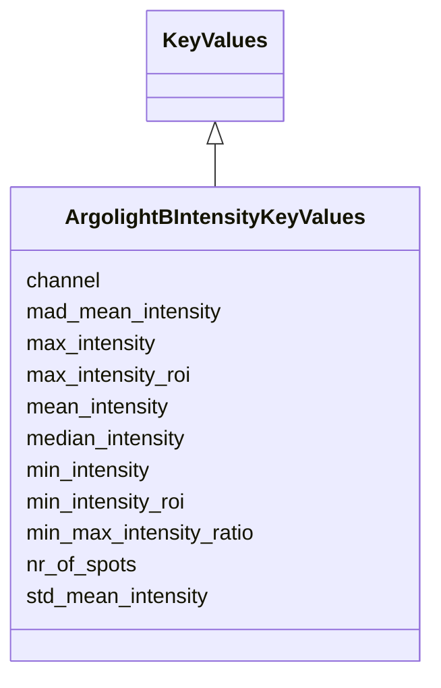

# Class: ArgolightBIntensityKeyValues


URI: [https://github.com/MontpellierRessourcesImagerie/microscope-metrics/blob/main/src/microscopemetrics/data_schema/samples/argolight_schema.yaml/:ArgolightBIntensityKeyValues](https://github.com/MontpellierRessourcesImagerie/microscope-metrics/blob/main/src/microscopemetrics/data_schema/samples/argolight_schema.yaml/:ArgolightBIntensityKeyValues)





## Inheritance
* [KeyValues](KeyValues.md)
    * **ArgolightBIntensityKeyValues**


## Slots

| Name | Cardinality and Range | Description | Inheritance |
| ---  | --- | --- | --- |
| [channel](channel.md) | 0..* <br/> [Integer](Integer.md) | The channel number to which the measurements apply | direct |
| [nr_of_spots](nr_of_spots.md) | 0..* <br/> [Integer](Integer.md) | Number of argolight spots detected for each channel | direct |
| [max_intensity](max_intensity.md) | 0..* <br/> [Float](Float.md) | Integrated intensity of the most intense spot for each channel | direct |
| [max_intensity_roi](max_intensity_roi.md) | 0..* <br/> [Integer](Integer.md) | ROI number of the most intense spot for each channel | direct |
| [min_intensity](min_intensity.md) | 0..* <br/> [Float](Float.md) | Integrated intensity of the least intense spot for each channel | direct |
| [min_intensity_roi](min_intensity_roi.md) | 0..* <br/> [Integer](Integer.md) | ROI number of the least intense spot for each channel | direct |
| [mean_intensity](mean_intensity.md) | 0..* <br/> [Float](Float.md) | Mean of all spots integrated intensity for each channel | direct |
| [median_intensity](median_intensity.md) | 0..* <br/> [Float](Float.md) | Median of all spots integrated intensity for each channel | direct |
| [std_mean_intensity](std_mean_intensity.md) | 0..* <br/> [Float](Float.md) | Standard deviation of all spots integrated intensity for each channel | direct |
| [mad_mean_intensity](mad_mean_intensity.md) | 0..* <br/> [Float](Float.md) | Median absolute deviation of all spots integrated intensity for each channel | direct |
| [min_max_intensity_ratio](min_max_intensity_ratio.md) | 0..* <br/> [Float](Float.md) | Ratio between the integrated intensities between the most intense and the lea... | direct |


## Usages

| used by | used in | type | used |
| ---  | --- | --- | --- |
| [ArgolightBOutput](ArgolightBOutput.md) | [intensity_measurements](intensity_measurements.md) | range | [ArgolightBIntensityKeyValues](ArgolightBIntensityKeyValues.md) |


## Identifier and Mapping Information


### Schema Source


* from schema: https://github.com/MontpellierRessourcesImagerie/microscope-metrics/blob/main/src/microscopemetrics/data_schema/samples/argolight_schema.yaml


## Mappings

| Mapping Type | Mapped Value |
| ---  | ---  |
| self | https://github.com/MontpellierRessourcesImagerie/microscope-metrics/blob/main/src/microscopemetrics/data_schema/samples/argolight_schema.yaml/:ArgolightBIntensityKeyValues |
| native | https://github.com/MontpellierRessourcesImagerie/microscope-metrics/blob/main/src/microscopemetrics/data_schema/samples/argolight_schema.yaml/:ArgolightBIntensityKeyValues |


## LinkML Source

<!-- TODO: investigate https://stackoverflow.com/questions/37606292/how-to-create-tabbed-code-blocks-in-mkdocs-or-sphinx -->

### Direct

<details>
```yaml
name: ArgolightBIntensityKeyValues
from_schema: https://github.com/MontpellierRessourcesImagerie/microscope-metrics/blob/main/src/microscopemetrics/data_schema/samples/argolight_schema.yaml
is_a: KeyValues
slots:
- channel
- nr_of_spots
- max_intensity
- max_intensity_roi
- min_intensity
- min_intensity_roi
- mean_intensity
- median_intensity
- std_mean_intensity
- mad_mean_intensity
- min_max_intensity_ratio

```
</details>

### Induced

<details>
```yaml
name: ArgolightBIntensityKeyValues
from_schema: https://github.com/MontpellierRessourcesImagerie/microscope-metrics/blob/main/src/microscopemetrics/data_schema/samples/argolight_schema.yaml
is_a: KeyValues
attributes:
  channel:
    name: channel
    description: The channel number to which the measurements apply
    from_schema: https://github.com/MontpellierRessourcesImagerie/microscope-metrics/blob/main/src/microscopemetrics/data_schema/samples/argolight_schema.yaml
    rank: 1000
    multivalued: true
    alias: channel
    owner: ArgolightBIntensityKeyValues
    domain_of:
    - ArgolightBIntensityKeyValues
    - ArgolightEKeyValues
    range: integer
  nr_of_spots:
    name: nr_of_spots
    description: Number of argolight spots detected for each channel
    from_schema: https://github.com/MontpellierRessourcesImagerie/microscope-metrics/blob/main/src/microscopemetrics/data_schema/samples/argolight_schema.yaml
    rank: 1000
    multivalued: true
    alias: nr_of_spots
    owner: ArgolightBIntensityKeyValues
    domain_of:
    - ArgolightBIntensityKeyValues
    range: integer
  max_intensity:
    name: max_intensity
    description: Integrated intensity of the most intense spot for each channel
    from_schema: https://github.com/MontpellierRessourcesImagerie/microscope-metrics/blob/main/src/microscopemetrics/data_schema/samples/argolight_schema.yaml
    rank: 1000
    multivalued: true
    alias: max_intensity
    owner: ArgolightBIntensityKeyValues
    domain_of:
    - ArgolightBIntensityKeyValues
    range: float
  max_intensity_roi:
    name: max_intensity_roi
    description: ROI number of the most intense spot for each channel
    from_schema: https://github.com/MontpellierRessourcesImagerie/microscope-metrics/blob/main/src/microscopemetrics/data_schema/samples/argolight_schema.yaml
    rank: 1000
    multivalued: true
    alias: max_intensity_roi
    owner: ArgolightBIntensityKeyValues
    domain_of:
    - ArgolightBIntensityKeyValues
    range: integer
  min_intensity:
    name: min_intensity
    description: Integrated intensity of the least intense spot for each channel
    from_schema: https://github.com/MontpellierRessourcesImagerie/microscope-metrics/blob/main/src/microscopemetrics/data_schema/samples/argolight_schema.yaml
    rank: 1000
    multivalued: true
    alias: min_intensity
    owner: ArgolightBIntensityKeyValues
    domain_of:
    - ArgolightBIntensityKeyValues
    range: float
  min_intensity_roi:
    name: min_intensity_roi
    description: ROI number of the least intense spot for each channel
    from_schema: https://github.com/MontpellierRessourcesImagerie/microscope-metrics/blob/main/src/microscopemetrics/data_schema/samples/argolight_schema.yaml
    rank: 1000
    multivalued: true
    alias: min_intensity_roi
    owner: ArgolightBIntensityKeyValues
    domain_of:
    - ArgolightBIntensityKeyValues
    range: integer
  mean_intensity:
    name: mean_intensity
    description: Mean of all spots integrated intensity for each channel
    from_schema: https://github.com/MontpellierRessourcesImagerie/microscope-metrics/blob/main/src/microscopemetrics/data_schema/samples/argolight_schema.yaml
    rank: 1000
    multivalued: true
    alias: mean_intensity
    owner: ArgolightBIntensityKeyValues
    domain_of:
    - ArgolightBIntensityKeyValues
    range: float
  median_intensity:
    name: median_intensity
    description: Median of all spots integrated intensity for each channel
    from_schema: https://github.com/MontpellierRessourcesImagerie/microscope-metrics/blob/main/src/microscopemetrics/data_schema/samples/argolight_schema.yaml
    rank: 1000
    multivalued: true
    alias: median_intensity
    owner: ArgolightBIntensityKeyValues
    domain_of:
    - ArgolightBIntensityKeyValues
    range: float
  std_mean_intensity:
    name: std_mean_intensity
    description: Standard deviation of all spots integrated intensity for each channel
    from_schema: https://github.com/MontpellierRessourcesImagerie/microscope-metrics/blob/main/src/microscopemetrics/data_schema/samples/argolight_schema.yaml
    rank: 1000
    multivalued: true
    alias: std_mean_intensity
    owner: ArgolightBIntensityKeyValues
    domain_of:
    - ArgolightBIntensityKeyValues
    range: float
  mad_mean_intensity:
    name: mad_mean_intensity
    description: Median absolute deviation of all spots integrated intensity for each
      channel
    from_schema: https://github.com/MontpellierRessourcesImagerie/microscope-metrics/blob/main/src/microscopemetrics/data_schema/samples/argolight_schema.yaml
    rank: 1000
    multivalued: true
    alias: mad_mean_intensity
    owner: ArgolightBIntensityKeyValues
    domain_of:
    - ArgolightBIntensityKeyValues
    range: float
  min_max_intensity_ratio:
    name: min_max_intensity_ratio
    description: Ratio between the integrated intensities between the most intense
      and the least intense spots for each channel
    from_schema: https://github.com/MontpellierRessourcesImagerie/microscope-metrics/blob/main/src/microscopemetrics/data_schema/samples/argolight_schema.yaml
    rank: 1000
    multivalued: true
    alias: min_max_intensity_ratio
    owner: ArgolightBIntensityKeyValues
    domain_of:
    - ArgolightBIntensityKeyValues
    range: float

```
</details>