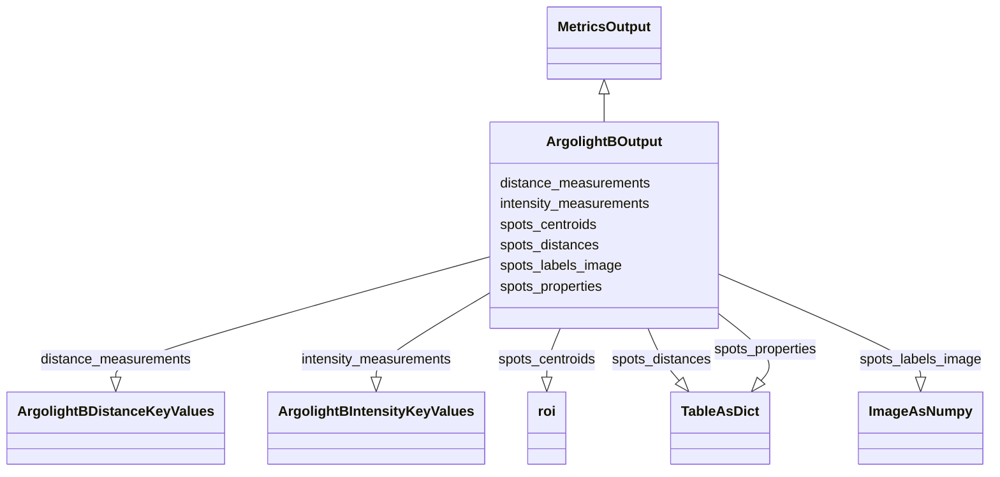

# Class: ArgolightBOutput


URI: [https://github.com/MontpellierRessourcesImagerie/microscope-metrics/blob/main/src/microscopemetrics/data_schema/samples/argolight_schema.yaml/:ArgolightBOutput](https://github.com/MontpellierRessourcesImagerie/microscope-metrics/blob/main/src/microscopemetrics/data_schema/samples/argolight_schema.yaml/:ArgolightBOutput)





## Inheritance
* [MetricsOutput](MetricsOutput.md)
    * **ArgolightBOutput**


## Slots

| Name | Cardinality and Range | Description | Inheritance |
| ---  | --- | --- | --- |
| [spots_labels_image](spots_labels_image.md) | 0..1 <br/> [ImageAsNumpy](ImageAsNumpy.md) | Labels image of the argolight segmented spots provided as a 5D numpy array in... | direct |
| [spots_centroids](spots_centroids.md) | 0..* <br/> [Roi](Roi.md) | Centroids of the argolight spots provided as a list of ROIs, one per channel | direct |
| [intensity_measurements](intensity_measurements.md) | 0..1 <br/> [ArgolightBIntensityKeyValues](ArgolightBIntensityKeyValues.md) | Key Intensity Measurements on Argolight spots | direct |
| [distance_measurements](distance_measurements.md) | 0..1 <br/> [ArgolightBDistanceKeyValues](ArgolightBDistanceKeyValues.md) | Key Distance Measurements on Argolight spots | direct |
| [spots_properties](spots_properties.md) | 0..1 <br/> [TableAsDict](TableAsDict.md) | Table of properties of the argolight spots | direct |
| [spots_distances](spots_distances.md) | 0..1 <br/> [TableAsDict](TableAsDict.md) | Table of distances between argolight spots | direct |


## Usages

| used by | used in | type | used |
| ---  | --- | --- | --- |
| [ArgolightBDataset](ArgolightBDataset.md) | [output](output.md) | range | [ArgolightBOutput](ArgolightBOutput.md) |


## Identifier and Mapping Information


### Schema Source


* from schema: https://github.com/MontpellierRessourcesImagerie/microscope-metrics/blob/main/src/microscopemetrics/data_schema/samples/argolight_schema.yaml


## Mappings

| Mapping Type | Mapped Value |
| ---  | ---  |
| self | https://github.com/MontpellierRessourcesImagerie/microscope-metrics/blob/main/src/microscopemetrics/data_schema/samples/argolight_schema.yaml/:ArgolightBOutput |
| native | https://github.com/MontpellierRessourcesImagerie/microscope-metrics/blob/main/src/microscopemetrics/data_schema/samples/argolight_schema.yaml/:ArgolightBOutput |


## LinkML Source

<!-- TODO: investigate https://stackoverflow.com/questions/37606292/how-to-create-tabbed-code-blocks-in-mkdocs-or-sphinx -->

### Direct

<details>
```yaml
name: ArgolightBOutput
from_schema: https://github.com/MontpellierRessourcesImagerie/microscope-metrics/blob/main/src/microscopemetrics/data_schema/samples/argolight_schema.yaml
is_a: MetricsOutput
attributes:
  spots_labels_image:
    name: spots_labels_image
    description: Labels image of the argolight segmented spots provided as a 5D numpy
      array in the order TZYXC. Image intensities correspond to ROI labels
    from_schema: https://github.com/MontpellierRessourcesImagerie/microscope-metrics/blob/main/src/microscopemetrics/data_schema/samples/argolight_schema.yaml
    rank: 1000
    multivalued: false
    range: ImageAsNumpy
    required: false
  spots_centroids:
    name: spots_centroids
    description: Centroids of the argolight spots provided as a list of ROIs, one
      per channel
    from_schema: https://github.com/MontpellierRessourcesImagerie/microscope-metrics/blob/main/src/microscopemetrics/data_schema/samples/argolight_schema.yaml
    rank: 1000
    multivalued: true
    range: roi
    required: false
  intensity_measurements:
    name: intensity_measurements
    description: Key Intensity Measurements on Argolight spots
    from_schema: https://github.com/MontpellierRessourcesImagerie/microscope-metrics/blob/main/src/microscopemetrics/data_schema/samples/argolight_schema.yaml
    rank: 1000
    multivalued: false
    range: ArgolightBIntensityKeyValues
    required: false
  distance_measurements:
    name: distance_measurements
    description: Key Distance Measurements on Argolight spots
    from_schema: https://github.com/MontpellierRessourcesImagerie/microscope-metrics/blob/main/src/microscopemetrics/data_schema/samples/argolight_schema.yaml
    rank: 1000
    multivalued: false
    range: ArgolightBDistanceKeyValues
    required: false
  spots_properties:
    name: spots_properties
    description: Table of properties of the argolight spots
    from_schema: https://github.com/MontpellierRessourcesImagerie/microscope-metrics/blob/main/src/microscopemetrics/data_schema/samples/argolight_schema.yaml
    rank: 1000
    multivalued: false
    range: TableAsDict
    required: false
  spots_distances:
    name: spots_distances
    description: Table of distances between argolight spots
    from_schema: https://github.com/MontpellierRessourcesImagerie/microscope-metrics/blob/main/src/microscopemetrics/data_schema/samples/argolight_schema.yaml
    rank: 1000
    multivalued: false
    range: TableAsDict
    required: false

```
</details>

### Induced

<details>
```yaml
name: ArgolightBOutput
from_schema: https://github.com/MontpellierRessourcesImagerie/microscope-metrics/blob/main/src/microscopemetrics/data_schema/samples/argolight_schema.yaml
is_a: MetricsOutput
attributes:
  spots_labels_image:
    name: spots_labels_image
    description: Labels image of the argolight segmented spots provided as a 5D numpy
      array in the order TZYXC. Image intensities correspond to ROI labels
    from_schema: https://github.com/MontpellierRessourcesImagerie/microscope-metrics/blob/main/src/microscopemetrics/data_schema/samples/argolight_schema.yaml
    rank: 1000
    multivalued: false
    alias: spots_labels_image
    owner: ArgolightBOutput
    domain_of:
    - ArgolightBOutput
    range: ImageAsNumpy
    required: false
  spots_centroids:
    name: spots_centroids
    description: Centroids of the argolight spots provided as a list of ROIs, one
      per channel
    from_schema: https://github.com/MontpellierRessourcesImagerie/microscope-metrics/blob/main/src/microscopemetrics/data_schema/samples/argolight_schema.yaml
    rank: 1000
    multivalued: true
    alias: spots_centroids
    owner: ArgolightBOutput
    domain_of:
    - ArgolightBOutput
    range: roi
    required: false
  intensity_measurements:
    name: intensity_measurements
    description: Key Intensity Measurements on Argolight spots
    from_schema: https://github.com/MontpellierRessourcesImagerie/microscope-metrics/blob/main/src/microscopemetrics/data_schema/samples/argolight_schema.yaml
    rank: 1000
    multivalued: false
    alias: intensity_measurements
    owner: ArgolightBOutput
    domain_of:
    - ArgolightBOutput
    range: ArgolightBIntensityKeyValues
    required: false
  distance_measurements:
    name: distance_measurements
    description: Key Distance Measurements on Argolight spots
    from_schema: https://github.com/MontpellierRessourcesImagerie/microscope-metrics/blob/main/src/microscopemetrics/data_schema/samples/argolight_schema.yaml
    rank: 1000
    multivalued: false
    alias: distance_measurements
    owner: ArgolightBOutput
    domain_of:
    - ArgolightBOutput
    range: ArgolightBDistanceKeyValues
    required: false
  spots_properties:
    name: spots_properties
    description: Table of properties of the argolight spots
    from_schema: https://github.com/MontpellierRessourcesImagerie/microscope-metrics/blob/main/src/microscopemetrics/data_schema/samples/argolight_schema.yaml
    rank: 1000
    multivalued: false
    alias: spots_properties
    owner: ArgolightBOutput
    domain_of:
    - ArgolightBOutput
    range: TableAsDict
    required: false
  spots_distances:
    name: spots_distances
    description: Table of distances between argolight spots
    from_schema: https://github.com/MontpellierRessourcesImagerie/microscope-metrics/blob/main/src/microscopemetrics/data_schema/samples/argolight_schema.yaml
    rank: 1000
    multivalued: false
    alias: spots_distances
    owner: ArgolightBOutput
    domain_of:
    - ArgolightBOutput
    range: TableAsDict
    required: false

```
</details>