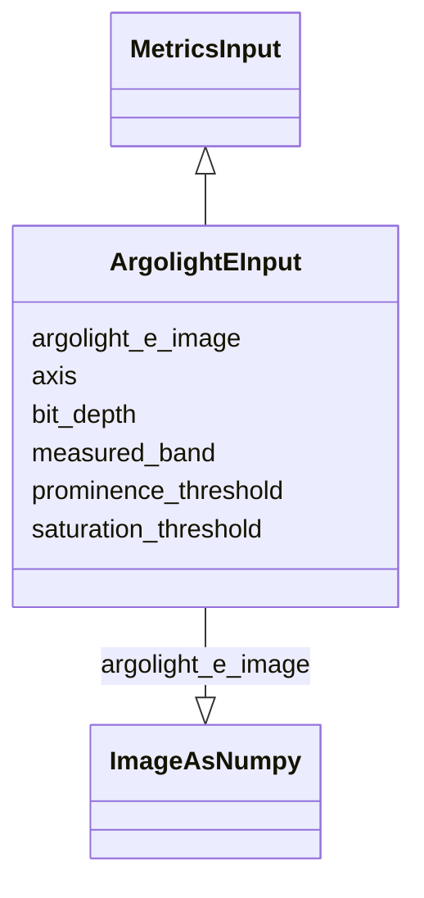

# Class: ArgolightEInput


URI: [https://github.com/MontpellierRessourcesImagerie/microscope-metrics/blob/main/src/microscopemetrics/data_schema/samples/argolight_schema.yaml/:ArgolightEInput](https://github.com/MontpellierRessourcesImagerie/microscope-metrics/blob/main/src/microscopemetrics/data_schema/samples/argolight_schema.yaml/:ArgolightEInput)





## Inheritance
* [MetricsInput](MetricsInput.md)
    * **ArgolightEInput**


## Slots

| Name | Cardinality and Range | Description | Inheritance |
| ---  | --- | --- | --- |
| [argolight_e_image](argolight_e_image.md) | 1..1 <br/> [ImageAsNumpy](ImageAsNumpy.md) | Image of the argolight e pattern provided as a 5D numpy array in the order TZ... | direct |
| [bit_depth](bit_depth.md) | 0..1 <br/> [Integer](Integer.md) | Detector bit depth | direct |
| [saturation_threshold](saturation_threshold.md) | 1..1 <br/> [Float](Float.md) | Tolerated saturation threshold | direct |
| [axis](axis.md) | 1..1 <br/> [Integer](Integer.md) | Axis along which resolution is being measured | direct |
| [measured_band](measured_band.md) | 1..1 <br/> [Float](Float.md) | Fraction of the image across which intensity profiles are measured | direct |
| [prominence_threshold](prominence_threshold.md) | 1..1 <br/> [Float](Float.md) | Peak prominence used as a threshold to distinguish two peaks | direct |


## Usages

| used by | used in | type | used |
| ---  | --- | --- | --- |
| [ArgolightEDataset](ArgolightEDataset.md) | [input](input.md) | range | [ArgolightEInput](ArgolightEInput.md) |


## Identifier and Mapping Information


### Schema Source


* from schema: https://github.com/MontpellierRessourcesImagerie/microscope-metrics/blob/main/src/microscopemetrics/data_schema/samples/argolight_schema.yaml


## Mappings

| Mapping Type | Mapped Value |
| ---  | ---  |
| self | https://github.com/MontpellierRessourcesImagerie/microscope-metrics/blob/main/src/microscopemetrics/data_schema/samples/argolight_schema.yaml/:ArgolightEInput |
| native | https://github.com/MontpellierRessourcesImagerie/microscope-metrics/blob/main/src/microscopemetrics/data_schema/samples/argolight_schema.yaml/:ArgolightEInput |


## LinkML Source

<!-- TODO: investigate https://stackoverflow.com/questions/37606292/how-to-create-tabbed-code-blocks-in-mkdocs-or-sphinx -->

### Direct

<details>
```yaml
name: ArgolightEInput
from_schema: https://github.com/MontpellierRessourcesImagerie/microscope-metrics/blob/main/src/microscopemetrics/data_schema/samples/argolight_schema.yaml
is_a: MetricsInput
slots:
- argolight_e_image
- bit_depth
- saturation_threshold
- axis
- measured_band
- prominence_threshold
slot_usage:
  saturation_threshold:
    name: saturation_threshold
    domain_of:
    - ArgolightBInput
    - ArgolightEInput
    required: true

```
</details>

### Induced

<details>
```yaml
name: ArgolightEInput
from_schema: https://github.com/MontpellierRessourcesImagerie/microscope-metrics/blob/main/src/microscopemetrics/data_schema/samples/argolight_schema.yaml
is_a: MetricsInput
slot_usage:
  saturation_threshold:
    name: saturation_threshold
    domain_of:
    - ArgolightBInput
    - ArgolightEInput
    required: true
attributes:
  argolight_e_image:
    name: argolight_e_image
    description: Image of the argolight e pattern provided as a 5D numpy array in
      the order TZYXC
    from_schema: https://github.com/MontpellierRessourcesImagerie/microscope-metrics/blob/main/src/microscopemetrics/data_schema/samples/argolight_schema.yaml
    rank: 1000
    multivalued: false
    alias: argolight_e_image
    owner: ArgolightEInput
    domain_of:
    - ArgolightEInput
    range: ImageAsNumpy
    required: true
    inlined: true
  bit_depth:
    name: bit_depth
    description: Detector bit depth
    from_schema: https://github.com/MontpellierRessourcesImagerie/microscope-metrics/blob/main/src/microscopemetrics/data_schema/samples/argolight_schema.yaml
    rank: 1000
    multivalued: false
    alias: bit_depth
    owner: ArgolightEInput
    domain_of:
    - ArgolightBInput
    - ArgolightEInput
    range: integer
    minimum_value: 1
    maximum_value: 64
  saturation_threshold:
    name: saturation_threshold
    description: Tolerated saturation threshold. If the amount of saturated pixels
      is above this threshold,  the image is considered as saturated and the analysis
      is not performed.
    from_schema: https://github.com/MontpellierRessourcesImagerie/microscope-metrics/blob/main/src/microscopemetrics/data_schema/samples/argolight_schema.yaml
    rank: 1000
    multivalued: false
    ifabsent: float(0.01)
    alias: saturation_threshold
    owner: ArgolightEInput
    domain_of:
    - ArgolightBInput
    - ArgolightEInput
    range: float
    required: true
    minimum_value: 0
    maximum_value: 1
  axis:
    name: axis
    description: Axis along which resolution is being measured. 1=Y, 2=X
    from_schema: https://github.com/MontpellierRessourcesImagerie/microscope-metrics/blob/main/src/microscopemetrics/data_schema/samples/argolight_schema.yaml
    rank: 1000
    multivalued: false
    alias: axis
    owner: ArgolightEInput
    domain_of:
    - ArgolightEInput
    range: integer
    required: true
    minimum_value: 1
    maximum_value: 2
  measured_band:
    name: measured_band
    description: Fraction of the image across which intensity profiles are measured
    from_schema: https://github.com/MontpellierRessourcesImagerie/microscope-metrics/blob/main/src/microscopemetrics/data_schema/samples/argolight_schema.yaml
    rank: 1000
    multivalued: false
    ifabsent: float(0.4)
    alias: measured_band
    owner: ArgolightEInput
    domain_of:
    - ArgolightEInput
    range: float
    required: true
    minimum_value: 0
    maximum_value: 1
  prominence_threshold:
    name: prominence_threshold
    description: Peak prominence used as a threshold to distinguish two peaks.  Defaults
      to the value defined by the Rayleigh criteria
    from_schema: https://github.com/MontpellierRessourcesImagerie/microscope-metrics/blob/main/src/microscopemetrics/data_schema/samples/argolight_schema.yaml
    rank: 1000
    multivalued: false
    ifabsent: float(0.264)
    alias: prominence_threshold
    owner: ArgolightEInput
    domain_of:
    - ArgolightEInput
    range: float
    required: true
    minimum_value: 0
    maximum_value: 0

```
</details>