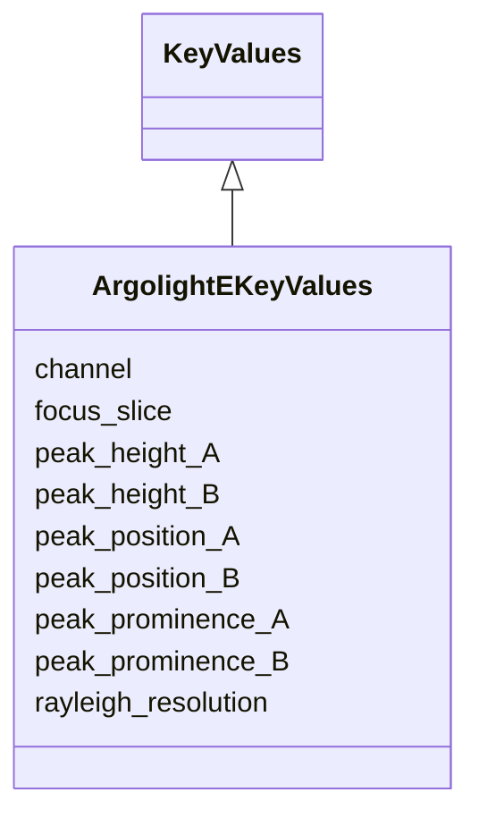

# Class: ArgolightEKeyValues


URI: [https://github.com/MontpellierRessourcesImagerie/microscope-metrics/blob/main/src/microscopemetrics/data_schema/samples/argolight_schema.yaml/:ArgolightEKeyValues](https://github.com/MontpellierRessourcesImagerie/microscope-metrics/blob/main/src/microscopemetrics/data_schema/samples/argolight_schema.yaml/:ArgolightEKeyValues)





## Inheritance
* [KeyValues](KeyValues.md)
    * **ArgolightEKeyValues**


## Slots

| Name | Cardinality and Range | Description | Inheritance |
| ---  | --- | --- | --- |
| [channel](channel.md) | 0..* <br/> [Integer](Integer.md) | The channel number to which the measurements apply | direct |
| [focus_slice](focus_slice.md) | 0..* <br/> [Integer](Integer.md) | Z position at which focus has been measured | direct |
| [rayleigh_resolution](rayleigh_resolution.md) | 0..* <br/> [Float](Float.md) | Rayleigh resolution measured | direct |
| [peak_position_A](peak_position_A.md) | 0..* <br/> [Float](Float.md) | Position of first peak in the intensity profiles | direct |
| [peak_position_B](peak_position_B.md) | 0..* <br/> [Float](Float.md) | Position of second peak in the intensity profiles | direct |
| [peak_height_A](peak_height_A.md) | 0..* <br/> [Float](Float.md) | Height of first peak in the intensity profiles | direct |
| [peak_height_B](peak_height_B.md) | 0..* <br/> [Float](Float.md) | Height of second peak in the intensity profiles | direct |
| [peak_prominence_A](peak_prominence_A.md) | 0..* <br/> [Float](Float.md) | Prominence of first peak in the intensity profiles | direct |
| [peak_prominence_B](peak_prominence_B.md) | 0..* <br/> [Float](Float.md) | Prominence of second peak in the intensity profiles | direct |


## Usages

| used by | used in | type | used |
| ---  | --- | --- | --- |
| [ArgolightEOutput](ArgolightEOutput.md) | [key_measurements](key_measurements.md) | range | [ArgolightEKeyValues](ArgolightEKeyValues.md) |


## Identifier and Mapping Information


### Schema Source


* from schema: https://github.com/MontpellierRessourcesImagerie/microscope-metrics/blob/main/src/microscopemetrics/data_schema/samples/argolight_schema.yaml


## Mappings

| Mapping Type | Mapped Value |
| ---  | ---  |
| self | https://github.com/MontpellierRessourcesImagerie/microscope-metrics/blob/main/src/microscopemetrics/data_schema/samples/argolight_schema.yaml/:ArgolightEKeyValues |
| native | https://github.com/MontpellierRessourcesImagerie/microscope-metrics/blob/main/src/microscopemetrics/data_schema/samples/argolight_schema.yaml/:ArgolightEKeyValues |


## LinkML Source

<!-- TODO: investigate https://stackoverflow.com/questions/37606292/how-to-create-tabbed-code-blocks-in-mkdocs-or-sphinx -->

### Direct

<details>
```yaml
name: ArgolightEKeyValues
from_schema: https://github.com/MontpellierRessourcesImagerie/microscope-metrics/blob/main/src/microscopemetrics/data_schema/samples/argolight_schema.yaml
is_a: KeyValues
slots:
- channel
- focus_slice
- rayleigh_resolution
- peak_position_A
- peak_position_B
- peak_height_A
- peak_height_B
- peak_prominence_A
- peak_prominence_B

```
</details>

### Induced

<details>
```yaml
name: ArgolightEKeyValues
from_schema: https://github.com/MontpellierRessourcesImagerie/microscope-metrics/blob/main/src/microscopemetrics/data_schema/samples/argolight_schema.yaml
is_a: KeyValues
attributes:
  channel:
    name: channel
    description: The channel number to which the measurements apply
    from_schema: https://github.com/MontpellierRessourcesImagerie/microscope-metrics/blob/main/src/microscopemetrics/data_schema/samples/argolight_schema.yaml
    rank: 1000
    multivalued: true
    alias: channel
    owner: ArgolightEKeyValues
    domain_of:
    - ArgolightBIntensityKeyValues
    - ArgolightEKeyValues
    range: integer
  focus_slice:
    name: focus_slice
    description: Z position at which focus has been measured
    from_schema: https://github.com/MontpellierRessourcesImagerie/microscope-metrics/blob/main/src/microscopemetrics/data_schema/samples/argolight_schema.yaml
    rank: 1000
    multivalued: true
    alias: focus_slice
    owner: ArgolightEKeyValues
    domain_of:
    - ArgolightEKeyValues
    range: integer
    minimum_value: 0
  rayleigh_resolution:
    name: rayleigh_resolution
    description: Rayleigh resolution measured
    from_schema: https://github.com/MontpellierRessourcesImagerie/microscope-metrics/blob/main/src/microscopemetrics/data_schema/samples/argolight_schema.yaml
    rank: 1000
    multivalued: true
    alias: rayleigh_resolution
    owner: ArgolightEKeyValues
    domain_of:
    - ArgolightEKeyValues
    range: float
  peak_position_A:
    name: peak_position_A
    description: Position of first peak in the intensity profiles
    from_schema: https://github.com/MontpellierRessourcesImagerie/microscope-metrics/blob/main/src/microscopemetrics/data_schema/samples/argolight_schema.yaml
    rank: 1000
    multivalued: true
    alias: peak_position_A
    owner: ArgolightEKeyValues
    domain_of:
    - ArgolightEKeyValues
    range: float
  peak_position_B:
    name: peak_position_B
    description: Position of second peak in the intensity profiles
    from_schema: https://github.com/MontpellierRessourcesImagerie/microscope-metrics/blob/main/src/microscopemetrics/data_schema/samples/argolight_schema.yaml
    rank: 1000
    multivalued: true
    alias: peak_position_B
    owner: ArgolightEKeyValues
    domain_of:
    - ArgolightEKeyValues
    range: float
  peak_height_A:
    name: peak_height_A
    description: Height of first peak in the intensity profiles
    from_schema: https://github.com/MontpellierRessourcesImagerie/microscope-metrics/blob/main/src/microscopemetrics/data_schema/samples/argolight_schema.yaml
    rank: 1000
    multivalued: true
    alias: peak_height_A
    owner: ArgolightEKeyValues
    domain_of:
    - ArgolightEKeyValues
    range: float
  peak_height_B:
    name: peak_height_B
    description: Height of second peak in the intensity profiles
    from_schema: https://github.com/MontpellierRessourcesImagerie/microscope-metrics/blob/main/src/microscopemetrics/data_schema/samples/argolight_schema.yaml
    rank: 1000
    multivalued: true
    alias: peak_height_B
    owner: ArgolightEKeyValues
    domain_of:
    - ArgolightEKeyValues
    range: float
  peak_prominence_A:
    name: peak_prominence_A
    description: Prominence of first peak in the intensity profiles
    from_schema: https://github.com/MontpellierRessourcesImagerie/microscope-metrics/blob/main/src/microscopemetrics/data_schema/samples/argolight_schema.yaml
    rank: 1000
    multivalued: true
    alias: peak_prominence_A
    owner: ArgolightEKeyValues
    domain_of:
    - ArgolightEKeyValues
    range: float
  peak_prominence_B:
    name: peak_prominence_B
    description: Prominence of second peak in the intensity profiles
    from_schema: https://github.com/MontpellierRessourcesImagerie/microscope-metrics/blob/main/src/microscopemetrics/data_schema/samples/argolight_schema.yaml
    rank: 1000
    multivalued: true
    alias: peak_prominence_B
    owner: ArgolightEKeyValues
    domain_of:
    - ArgolightEKeyValues
    range: float

```
</details>