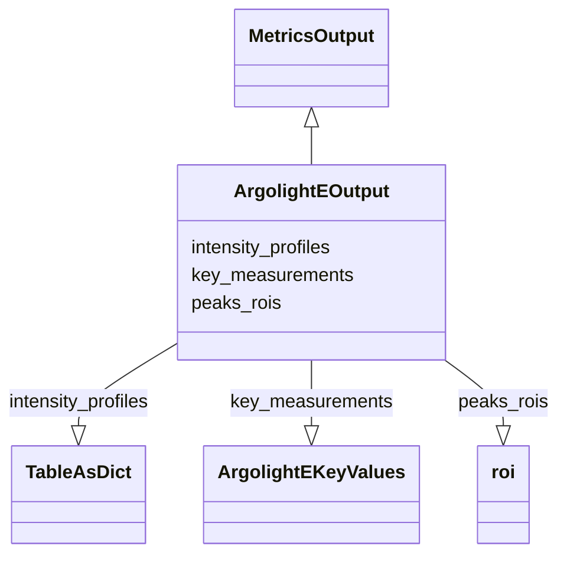

# Class: ArgolightEOutput


URI: [https://github.com/MontpellierRessourcesImagerie/microscope-metrics/blob/main/src/microscopemetrics/data_schema/samples/argolight_schema.yaml/:ArgolightEOutput](https://github.com/MontpellierRessourcesImagerie/microscope-metrics/blob/main/src/microscopemetrics/data_schema/samples/argolight_schema.yaml/:ArgolightEOutput)





## Inheritance
* [MetricsOutput](MetricsOutput.md)
    * **ArgolightEOutput**


## Slots

| Name | Cardinality and Range | Description | Inheritance |
| ---  | --- | --- | --- |
| [peaks_rois](peaks_rois.md) | 0..* <br/> [Roi](Roi.md) | ROIs of the peaks found in the argolight images | direct |
| [key_measurements](key_measurements.md) | 0..1 <br/> [ArgolightEKeyValues](ArgolightEKeyValues.md) | Key Measurements on Argolight E images | direct |
| [intensity_profiles](intensity_profiles.md) | 0..1 <br/> [TableAsDict](TableAsDict.md) | Intensity profiles of the argolight lines provided as tables | direct |


## Usages

| used by | used in | type | used |
| ---  | --- | --- | --- |
| [ArgolightEDataset](ArgolightEDataset.md) | [output](output.md) | range | [ArgolightEOutput](ArgolightEOutput.md) |


## Identifier and Mapping Information


### Schema Source


* from schema: https://github.com/MontpellierRessourcesImagerie/microscope-metrics/blob/main/src/microscopemetrics/data_schema/samples/argolight_schema.yaml


## Mappings

| Mapping Type | Mapped Value |
| ---  | ---  |
| self | https://github.com/MontpellierRessourcesImagerie/microscope-metrics/blob/main/src/microscopemetrics/data_schema/samples/argolight_schema.yaml/:ArgolightEOutput |
| native | https://github.com/MontpellierRessourcesImagerie/microscope-metrics/blob/main/src/microscopemetrics/data_schema/samples/argolight_schema.yaml/:ArgolightEOutput |


## LinkML Source

<!-- TODO: investigate https://stackoverflow.com/questions/37606292/how-to-create-tabbed-code-blocks-in-mkdocs-or-sphinx -->

### Direct

<details>
```yaml
name: ArgolightEOutput
from_schema: https://github.com/MontpellierRessourcesImagerie/microscope-metrics/blob/main/src/microscopemetrics/data_schema/samples/argolight_schema.yaml
is_a: MetricsOutput
attributes:
  peaks_rois:
    name: peaks_rois
    description: ROIs of the peaks found in the argolight images
    from_schema: https://github.com/MontpellierRessourcesImagerie/microscope-metrics/blob/main/src/microscopemetrics/data_schema/samples/argolight_schema.yaml
    rank: 1000
    multivalued: true
    range: roi
  key_measurements:
    name: key_measurements
    description: Key Measurements on Argolight E images
    from_schema: https://github.com/MontpellierRessourcesImagerie/microscope-metrics/blob/main/src/microscopemetrics/data_schema/samples/argolight_schema.yaml
    rank: 1000
    multivalued: false
    range: ArgolightEKeyValues
  intensity_profiles:
    name: intensity_profiles
    description: Intensity profiles of the argolight lines provided as tables. One
      table per channel
    from_schema: https://github.com/MontpellierRessourcesImagerie/microscope-metrics/blob/main/src/microscopemetrics/data_schema/samples/argolight_schema.yaml
    rank: 1000
    multivalued: false
    range: TableAsDict

```
</details>

### Induced

<details>
```yaml
name: ArgolightEOutput
from_schema: https://github.com/MontpellierRessourcesImagerie/microscope-metrics/blob/main/src/microscopemetrics/data_schema/samples/argolight_schema.yaml
is_a: MetricsOutput
attributes:
  peaks_rois:
    name: peaks_rois
    description: ROIs of the peaks found in the argolight images
    from_schema: https://github.com/MontpellierRessourcesImagerie/microscope-metrics/blob/main/src/microscopemetrics/data_schema/samples/argolight_schema.yaml
    rank: 1000
    multivalued: true
    alias: peaks_rois
    owner: ArgolightEOutput
    domain_of:
    - ArgolightEOutput
    range: roi
  key_measurements:
    name: key_measurements
    description: Key Measurements on Argolight E images
    from_schema: https://github.com/MontpellierRessourcesImagerie/microscope-metrics/blob/main/src/microscopemetrics/data_schema/samples/argolight_schema.yaml
    rank: 1000
    multivalued: false
    alias: key_measurements
    owner: ArgolightEOutput
    domain_of:
    - ArgolightEOutput
    range: ArgolightEKeyValues
  intensity_profiles:
    name: intensity_profiles
    description: Intensity profiles of the argolight lines provided as tables. One
      table per channel
    from_schema: https://github.com/MontpellierRessourcesImagerie/microscope-metrics/blob/main/src/microscopemetrics/data_schema/samples/argolight_schema.yaml
    rank: 1000
    multivalued: false
    alias: intensity_profiles
    owner: ArgolightEOutput
    domain_of:
    - ArgolightEOutput
    range: TableAsDict

```
</details>