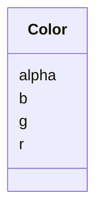

# Class: Color


_A color as defined by RGB values and an optional alpha value_


URI: [https://github.com/MontpellierRessourcesImagerie/microscope-metrics/blob/main/src/microscopemetrics/data_schema/samples/argolight_schema.yaml/:Color](https://github.com/MontpellierRessourcesImagerie/microscope-metrics/blob/main/src/microscopemetrics/data_schema/samples/argolight_schema.yaml/:Color)





<!-- no inheritance hierarchy -->


## Slots

| Name | Cardinality and Range | Description | Inheritance |
| ---  | --- | --- | --- |
| [r](r.md) | 1..1 <br/> [Integer](Integer.md) |  | direct |
| [g](g.md) | 1..1 <br/> [Integer](Integer.md) |  | direct |
| [b](b.md) | 1..1 <br/> [Integer](Integer.md) |  | direct |
| [alpha](alpha.md) | 0..1 <br/> [Integer](Integer.md) |  | direct |


## Usages

| used by | used in | type | used |
| ---  | --- | --- | --- |
| [Shape](Shape.md) | [fill_color](fill_color.md) | range | [Color](Color.md) |
| [Shape](Shape.md) | [stroke_color](stroke_color.md) | range | [Color](Color.md) |
| [Point](Point.md) | [fill_color](fill_color.md) | range | [Color](Color.md) |
| [Point](Point.md) | [stroke_color](stroke_color.md) | range | [Color](Color.md) |
| [Line](Line.md) | [fill_color](fill_color.md) | range | [Color](Color.md) |
| [Line](Line.md) | [stroke_color](stroke_color.md) | range | [Color](Color.md) |
| [Rectangle](Rectangle.md) | [fill_color](fill_color.md) | range | [Color](Color.md) |
| [Rectangle](Rectangle.md) | [stroke_color](stroke_color.md) | range | [Color](Color.md) |
| [Ellipse](Ellipse.md) | [fill_color](fill_color.md) | range | [Color](Color.md) |
| [Ellipse](Ellipse.md) | [stroke_color](stroke_color.md) | range | [Color](Color.md) |
| [Polygon](Polygon.md) | [fill_color](fill_color.md) | range | [Color](Color.md) |
| [Polygon](Polygon.md) | [stroke_color](stroke_color.md) | range | [Color](Color.md) |
| [Mask](Mask.md) | [fill_color](fill_color.md) | range | [Color](Color.md) |
| [Mask](Mask.md) | [stroke_color](stroke_color.md) | range | [Color](Color.md) |


## Identifier and Mapping Information


### Schema Source


* from schema: https://github.com/MontpellierRessourcesImagerie/microscope-metrics/blob/main/src/microscopemetrics/data_schema/samples/argolight_schema.yaml


## Mappings

| Mapping Type | Mapped Value |
| ---  | ---  |
| self | https://github.com/MontpellierRessourcesImagerie/microscope-metrics/blob/main/src/microscopemetrics/data_schema/samples/argolight_schema.yaml/:Color |
| native | https://github.com/MontpellierRessourcesImagerie/microscope-metrics/blob/main/src/microscopemetrics/data_schema/samples/argolight_schema.yaml/:Color |


## LinkML Source

<!-- TODO: investigate https://stackoverflow.com/questions/37606292/how-to-create-tabbed-code-blocks-in-mkdocs-or-sphinx -->

### Direct

<details>
```yaml
name: Color
description: A color as defined by RGB values and an optional alpha value
from_schema: https://github.com/MontpellierRessourcesImagerie/microscope-metrics/blob/main/src/microscopemetrics/data_schema/samples/argolight_schema.yaml
attributes:
  r:
    name: r
    from_schema: https://github.com/MontpellierRessourcesImagerie/microscope-metrics/blob/main/src/microscopemetrics/data_schema/core_schema.yaml
    rank: 1000
    multivalued: false
    ifabsent: int(128)
    range: integer
    required: true
    minimum_value: 0
    maximum_value: 255
  g:
    name: g
    from_schema: https://github.com/MontpellierRessourcesImagerie/microscope-metrics/blob/main/src/microscopemetrics/data_schema/core_schema.yaml
    rank: 1000
    multivalued: false
    ifabsent: int(128)
    range: integer
    required: true
    minimum_value: 0
    maximum_value: 255
  b:
    name: b
    from_schema: https://github.com/MontpellierRessourcesImagerie/microscope-metrics/blob/main/src/microscopemetrics/data_schema/core_schema.yaml
    rank: 1000
    multivalued: false
    ifabsent: int(128)
    range: integer
    required: true
    minimum_value: 0
    maximum_value: 255
  alpha:
    name: alpha
    from_schema: https://github.com/MontpellierRessourcesImagerie/microscope-metrics/blob/main/src/microscopemetrics/data_schema/core_schema.yaml
    rank: 1000
    multivalued: false
    ifabsent: int(255)
    range: integer
    required: false
    minimum_value: 0
    maximum_value: 255

```
</details>

### Induced

<details>
```yaml
name: Color
description: A color as defined by RGB values and an optional alpha value
from_schema: https://github.com/MontpellierRessourcesImagerie/microscope-metrics/blob/main/src/microscopemetrics/data_schema/samples/argolight_schema.yaml
attributes:
  r:
    name: r
    from_schema: https://github.com/MontpellierRessourcesImagerie/microscope-metrics/blob/main/src/microscopemetrics/data_schema/core_schema.yaml
    rank: 1000
    multivalued: false
    ifabsent: int(128)
    alias: r
    owner: Color
    domain_of:
    - Color
    range: integer
    required: true
    minimum_value: 0
    maximum_value: 255
  g:
    name: g
    from_schema: https://github.com/MontpellierRessourcesImagerie/microscope-metrics/blob/main/src/microscopemetrics/data_schema/core_schema.yaml
    rank: 1000
    multivalued: false
    ifabsent: int(128)
    alias: g
    owner: Color
    domain_of:
    - Color
    range: integer
    required: true
    minimum_value: 0
    maximum_value: 255
  b:
    name: b
    from_schema: https://github.com/MontpellierRessourcesImagerie/microscope-metrics/blob/main/src/microscopemetrics/data_schema/core_schema.yaml
    rank: 1000
    multivalued: false
    ifabsent: int(128)
    alias: b
    owner: Color
    domain_of:
    - Color
    range: integer
    required: true
    minimum_value: 0
    maximum_value: 255
  alpha:
    name: alpha
    from_schema: https://github.com/MontpellierRessourcesImagerie/microscope-metrics/blob/main/src/microscopemetrics/data_schema/core_schema.yaml
    rank: 1000
    multivalued: false
    ifabsent: int(255)
    alias: alpha
    owner: Color
    domain_of:
    - Color
    range: integer
    required: false
    minimum_value: 0
    maximum_value: 255

```
</details>