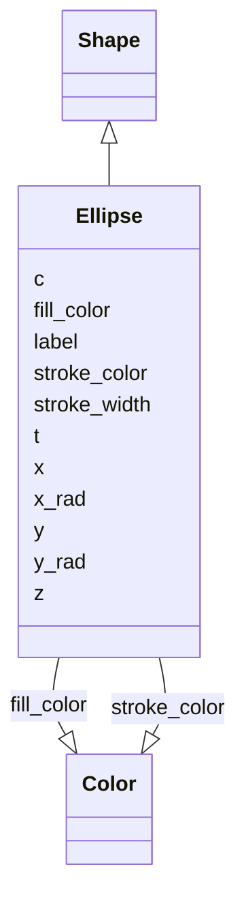

# Class: Ellipse


_An ellipse as defined by x, y coordinates and x and y radii_


URI: [https://github.com/MontpellierRessourcesImagerie/microscope-metrics/blob/main/src/microscopemetrics/data_schema/samples/argolight_schema.yaml/:Ellipse](https://github.com/MontpellierRessourcesImagerie/microscope-metrics/blob/main/src/microscopemetrics/data_schema/samples/argolight_schema.yaml/:Ellipse)





## Inheritance
* [Shape](Shape.md)
    * **Ellipse**


## Slots

| Name | Cardinality and Range | Description | Inheritance |
| ---  | --- | --- | --- |
| [x](x.md) | 1..1 <br/> [Float](Float.md) |  | direct |
| [y](y.md) | 1..1 <br/> [Float](Float.md) |  | direct |
| [x_rad](x_rad.md) | 1..1 <br/> [Float](Float.md) |  | direct |
| [y_rad](y_rad.md) | 1..1 <br/> [Float](Float.md) |  | direct |
| [label](label.md) | 0..1 <br/> [String](String.md) |  | [Shape](Shape.md) |
| [z](z.md) | 0..1 <br/> [Float](Float.md) |  | [Shape](Shape.md) |
| [c](c.md) | 0..1 <br/> [Integer](Integer.md) |  | [Shape](Shape.md) |
| [t](t.md) | 0..1 <br/> [Integer](Integer.md) |  | [Shape](Shape.md) |
| [fill_color](fill_color.md) | 0..1 <br/> [Color](Color.md) |  | [Shape](Shape.md) |
| [stroke_color](stroke_color.md) | 0..1 <br/> [Color](Color.md) |  | [Shape](Shape.md) |
| [stroke_width](stroke_width.md) | 0..1 <br/> [Integer](Integer.md) |  | [Shape](Shape.md) |


## Identifier and Mapping Information


### Schema Source


* from schema: https://github.com/MontpellierRessourcesImagerie/microscope-metrics/blob/main/src/microscopemetrics/data_schema/samples/argolight_schema.yaml


## Mappings

| Mapping Type | Mapped Value |
| ---  | ---  |
| self | https://github.com/MontpellierRessourcesImagerie/microscope-metrics/blob/main/src/microscopemetrics/data_schema/samples/argolight_schema.yaml/:Ellipse |
| native | https://github.com/MontpellierRessourcesImagerie/microscope-metrics/blob/main/src/microscopemetrics/data_schema/samples/argolight_schema.yaml/:Ellipse |


## LinkML Source

<!-- TODO: investigate https://stackoverflow.com/questions/37606292/how-to-create-tabbed-code-blocks-in-mkdocs-or-sphinx -->

### Direct

<details>
```yaml
name: Ellipse
description: An ellipse as defined by x, y coordinates and x and y radii
from_schema: https://github.com/MontpellierRessourcesImagerie/microscope-metrics/blob/main/src/microscopemetrics/data_schema/samples/argolight_schema.yaml
is_a: Shape
attributes:
  x:
    name: x
    from_schema: https://github.com/MontpellierRessourcesImagerie/microscope-metrics/blob/main/src/microscopemetrics/data_schema/core_schema.yaml
    multivalued: false
    range: float
    required: true
  y:
    name: y
    from_schema: https://github.com/MontpellierRessourcesImagerie/microscope-metrics/blob/main/src/microscopemetrics/data_schema/core_schema.yaml
    multivalued: false
    range: float
    required: true
  x_rad:
    name: x_rad
    from_schema: https://github.com/MontpellierRessourcesImagerie/microscope-metrics/blob/main/src/microscopemetrics/data_schema/core_schema.yaml
    rank: 1000
    multivalued: false
    range: float
    required: true
  y_rad:
    name: y_rad
    from_schema: https://github.com/MontpellierRessourcesImagerie/microscope-metrics/blob/main/src/microscopemetrics/data_schema/core_schema.yaml
    rank: 1000
    multivalued: false
    range: float
    required: true

```
</details>

### Induced

<details>
```yaml
name: Ellipse
description: An ellipse as defined by x, y coordinates and x and y radii
from_schema: https://github.com/MontpellierRessourcesImagerie/microscope-metrics/blob/main/src/microscopemetrics/data_schema/samples/argolight_schema.yaml
is_a: Shape
attributes:
  x:
    name: x
    from_schema: https://github.com/MontpellierRessourcesImagerie/microscope-metrics/blob/main/src/microscopemetrics/data_schema/core_schema.yaml
    multivalued: false
    alias: x
    owner: Ellipse
    domain_of:
    - ImageMask
    - Image2D
    - Image5D
    - Point
    - Rectangle
    - Ellipse
    - Vertex
    - Mask
    range: float
    required: true
  y:
    name: y
    from_schema: https://github.com/MontpellierRessourcesImagerie/microscope-metrics/blob/main/src/microscopemetrics/data_schema/core_schema.yaml
    multivalued: false
    alias: y
    owner: Ellipse
    domain_of:
    - ImageMask
    - Image2D
    - Image5D
    - Point
    - Rectangle
    - Ellipse
    - Vertex
    - Mask
    range: float
    required: true
  x_rad:
    name: x_rad
    from_schema: https://github.com/MontpellierRessourcesImagerie/microscope-metrics/blob/main/src/microscopemetrics/data_schema/core_schema.yaml
    rank: 1000
    multivalued: false
    alias: x_rad
    owner: Ellipse
    domain_of:
    - Ellipse
    range: float
    required: true
  y_rad:
    name: y_rad
    from_schema: https://github.com/MontpellierRessourcesImagerie/microscope-metrics/blob/main/src/microscopemetrics/data_schema/core_schema.yaml
    rank: 1000
    multivalued: false
    alias: y_rad
    owner: Ellipse
    domain_of:
    - Ellipse
    range: float
    required: true
  label:
    name: label
    from_schema: https://github.com/MontpellierRessourcesImagerie/microscope-metrics/blob/main/src/microscopemetrics/data_schema/core_schema.yaml
    alias: label
    owner: Ellipse
    domain_of:
    - ROI
    - Shape
    range: string
    required: false
  z:
    name: z
    from_schema: https://github.com/MontpellierRessourcesImagerie/microscope-metrics/blob/main/src/microscopemetrics/data_schema/core_schema.yaml
    alias: z
    owner: Ellipse
    domain_of:
    - Image5D
    - Shape
    range: float
    required: false
  c:
    name: c
    from_schema: https://github.com/MontpellierRessourcesImagerie/microscope-metrics/blob/main/src/microscopemetrics/data_schema/core_schema.yaml
    alias: c
    owner: Ellipse
    domain_of:
    - Image5D
    - Shape
    range: integer
    required: false
  t:
    name: t
    from_schema: https://github.com/MontpellierRessourcesImagerie/microscope-metrics/blob/main/src/microscopemetrics/data_schema/core_schema.yaml
    alias: t
    owner: Ellipse
    domain_of:
    - Image5D
    - Shape
    range: integer
    required: false
  fill_color:
    name: fill_color
    from_schema: https://github.com/MontpellierRessourcesImagerie/microscope-metrics/blob/main/src/microscopemetrics/data_schema/core_schema.yaml
    rank: 1000
    alias: fill_color
    owner: Ellipse
    domain_of:
    - Shape
    range: Color
    required: false
  stroke_color:
    name: stroke_color
    from_schema: https://github.com/MontpellierRessourcesImagerie/microscope-metrics/blob/main/src/microscopemetrics/data_schema/core_schema.yaml
    rank: 1000
    alias: stroke_color
    owner: Ellipse
    domain_of:
    - Shape
    range: Color
    required: false
  stroke_width:
    name: stroke_width
    from_schema: https://github.com/MontpellierRessourcesImagerie/microscope-metrics/blob/main/src/microscopemetrics/data_schema/core_schema.yaml
    rank: 1000
    ifabsent: int(1)
    alias: stroke_width
    owner: Ellipse
    domain_of:
    - Shape
    range: integer
    required: false

```
</details>