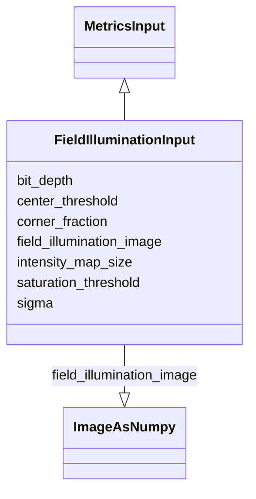

# Class: FieldIlluminationInput


URI: [https://github.com/MontpellierRessourcesImagerie/microscope-metrics/blob/main/src/microscopemetrics/data_schema/samples/field_illumination_schema.yaml/:FieldIlluminationInput](https://github.com/MontpellierRessourcesImagerie/microscope-metrics/blob/main/src/microscopemetrics/data_schema/samples/field_illumination_schema.yaml/:FieldIlluminationInput)





## Inheritance
* [MetricsInput](MetricsInput.md)
    * **FieldIlluminationInput**


## Slots

| Name | Cardinality and Range | Description | Inheritance |
| ---  | --- | --- | --- |
| [field_illumination_image](field_illumination_image.md) | 1..1 <br/> [ImageAsNumpy](ImageAsNumpy.md) | Input parameter: homogeneity image provided as a numpy array in the order | direct |
| [bit_depth](bit_depth.md) | 0..1 <br/> [Integer](Integer.md) | Detector bit depth | direct |
| [saturation_threshold](saturation_threshold.md) | 1..1 <br/> [Float](Float.md) | Tolerated saturation threshold | direct |
| [center_threshold](center_threshold.md) | 1..1 <br/> [Float](Float.md) | Input parameter: relative threshold for what is going to be considered as the... | direct |
| [corner_fraction](corner_fraction.md) | 1..1 <br/> [Float](Float.md) | Input parameter: the proportion of the image to be considered as corner or ce... | direct |
| [sigma](sigma.md) | 1..1 <br/> [Float](Float.md) | Input parameter: the sigma for the smoothing gaussian filter to be applied pr... | direct |
| [intensity_map_size](intensity_map_size.md) | 1..1 <br/> [Integer](Integer.md) | Input parameter: the size of the output intensity map in pixels | direct |


## Usages

| used by | used in | type | used |
| ---  | --- | --- | --- |
| [FieldIlluminationDataset](FieldIlluminationDataset.md) | [input](input.md) | range | [FieldIlluminationInput](FieldIlluminationInput.md) |


## Identifier and Mapping Information


### Schema Source


* from schema: https://github.com/MontpellierRessourcesImagerie/microscope-metrics/blob/main/src/microscopemetrics/data_schema/samples/field_illumination_schema.yaml


## Mappings

| Mapping Type | Mapped Value |
| ---  | ---  |
| self | https://github.com/MontpellierRessourcesImagerie/microscope-metrics/blob/main/src/microscopemetrics/data_schema/samples/field_illumination_schema.yaml/:FieldIlluminationInput |
| native | https://github.com/MontpellierRessourcesImagerie/microscope-metrics/blob/main/src/microscopemetrics/data_schema/samples/field_illumination_schema.yaml/:FieldIlluminationInput |


## LinkML Source

<!-- TODO: investigate https://stackoverflow.com/questions/37606292/how-to-create-tabbed-code-blocks-in-mkdocs-or-sphinx -->

### Direct

<details>
```yaml
name: FieldIlluminationInput
from_schema: https://github.com/MontpellierRessourcesImagerie/microscope-metrics/blob/main/src/microscopemetrics/data_schema/samples/field_illumination_schema.yaml
is_a: MetricsInput
slots:
- field_illumination_image
- bit_depth
- saturation_threshold
- center_threshold
- corner_fraction
- sigma
- intensity_map_size
slot_usage:
  saturation_threshold:
    name: saturation_threshold
    domain_of:
    - FieldIlluminationInput
    required: true

```
</details>

### Induced

<details>
```yaml
name: FieldIlluminationInput
from_schema: https://github.com/MontpellierRessourcesImagerie/microscope-metrics/blob/main/src/microscopemetrics/data_schema/samples/field_illumination_schema.yaml
is_a: MetricsInput
slot_usage:
  saturation_threshold:
    name: saturation_threshold
    domain_of:
    - FieldIlluminationInput
    required: true
attributes:
  field_illumination_image:
    name: field_illumination_image
    description: 'Input parameter: homogeneity image provided as a numpy array in
      the order. While the analysis accepts multiple channels, the T and Z dimensions
      are expected to be 1.'
    from_schema: https://github.com/MontpellierRessourcesImagerie/microscope-metrics/blob/main/src/microscopemetrics/data_schema/samples/field_illumination_schema.yaml
    rank: 1000
    multivalued: false
    alias: field_illumination_image
    owner: FieldIlluminationInput
    domain_of:
    - FieldIlluminationInput
    range: ImageAsNumpy
    required: true
    inlined: true
  bit_depth:
    name: bit_depth
    description: Detector bit depth
    from_schema: https://github.com/MontpellierRessourcesImagerie/microscope-metrics/blob/main/src/microscopemetrics/data_schema/samples/field_illumination_schema.yaml
    rank: 1000
    multivalued: false
    alias: bit_depth
    owner: FieldIlluminationInput
    domain_of:
    - FieldIlluminationInput
    range: integer
    minimum_value: 1
    maximum_value: 64
  saturation_threshold:
    name: saturation_threshold
    description: Tolerated saturation threshold. If the amount of saturated pixels
      is above this threshold,  the image is considered as saturated and the analysis
      is not performed.
    from_schema: https://github.com/MontpellierRessourcesImagerie/microscope-metrics/blob/main/src/microscopemetrics/data_schema/samples/field_illumination_schema.yaml
    rank: 1000
    multivalued: false
    ifabsent: float(0.01)
    alias: saturation_threshold
    owner: FieldIlluminationInput
    domain_of:
    - FieldIlluminationInput
    range: float
    required: true
    minimum_value: 0
    maximum_value: 1
  center_threshold:
    name: center_threshold
    description: 'Input parameter: relative threshold for what is going to be considered
      as the intensity center of the image'
    from_schema: https://github.com/MontpellierRessourcesImagerie/microscope-metrics/blob/main/src/microscopemetrics/data_schema/samples/field_illumination_schema.yaml
    rank: 1000
    multivalued: false
    ifabsent: float(0.9)
    alias: center_threshold
    owner: FieldIlluminationInput
    domain_of:
    - FieldIlluminationInput
    range: float
    required: true
    minimum_value: 0
    maximum_value: 1
  corner_fraction:
    name: corner_fraction
    description: 'Input parameter: the proportion of the image to be considered as
      corner or center'
    from_schema: https://github.com/MontpellierRessourcesImagerie/microscope-metrics/blob/main/src/microscopemetrics/data_schema/samples/field_illumination_schema.yaml
    rank: 1000
    multivalued: false
    ifabsent: float(0.1)
    alias: corner_fraction
    owner: FieldIlluminationInput
    domain_of:
    - FieldIlluminationInput
    range: float
    required: true
    minimum_value: 0
    maximum_value: 0
  sigma:
    name: sigma
    description: 'Input parameter: the sigma for the smoothing gaussian filter to
      be applied prior to analysis'
    from_schema: https://github.com/MontpellierRessourcesImagerie/microscope-metrics/blob/main/src/microscopemetrics/data_schema/samples/field_illumination_schema.yaml
    rank: 1000
    multivalued: false
    ifabsent: float(2.0)
    alias: sigma
    owner: FieldIlluminationInput
    domain_of:
    - FieldIlluminationInput
    range: float
    required: true
    minimum_value: 0
    maximum_value: 100
  intensity_map_size:
    name: intensity_map_size
    description: 'Input parameter: the size of the output intensity map in pixels'
    from_schema: https://github.com/MontpellierRessourcesImagerie/microscope-metrics/blob/main/src/microscopemetrics/data_schema/samples/field_illumination_schema.yaml
    rank: 1000
    multivalued: false
    ifabsent: int(64)
    alias: intensity_map_size
    owner: FieldIlluminationInput
    domain_of:
    - FieldIlluminationInput
    range: integer
    required: true
    minimum_value: 5
    maximum_value: 512

```
</details>