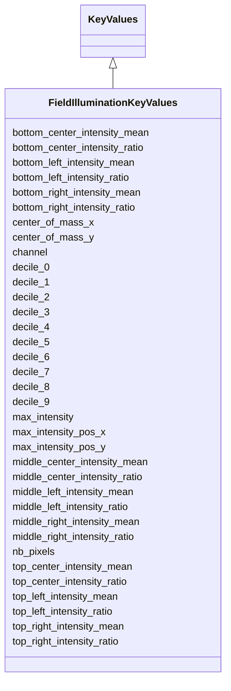

# Class: FieldIlluminationKeyValues


URI: [https://github.com/MontpellierRessourcesImagerie/microscope-metrics/blob/main/src/microscopemetrics/data_schema/samples/field_illumination_schema.yaml/:FieldIlluminationKeyValues](https://github.com/MontpellierRessourcesImagerie/microscope-metrics/blob/main/src/microscopemetrics/data_schema/samples/field_illumination_schema.yaml/:FieldIlluminationKeyValues)





## Inheritance
* [KeyValues](KeyValues.md)
    * **FieldIlluminationKeyValues**


## Slots

| Name | Cardinality and Range | Description | Inheritance |
| ---  | --- | --- | --- |
| [channel](channel.md) | 0..* <br/> [Integer](Integer.md) | The channel number to which the measurements apply | direct |
| [nb_pixels](nb_pixels.md) | 0..* <br/> [Integer](Integer.md) | The area occupied by the center of illumination region | direct |
| [center_of_mass_x](center_of_mass_x.md) | 0..* <br/> [Float](Float.md) | The x coordinate of the center of mass of the center of illumination region | direct |
| [center_of_mass_y](center_of_mass_y.md) | 0..* <br/> [Float](Float.md) | The y coordinate of the center of mass of the center of illumination region | direct |
| [max_intensity](max_intensity.md) | 0..* <br/> [Float](Float.md) | The maximum intensity of the center of illumination | direct |
| [max_intensity_pos_x](max_intensity_pos_x.md) | 0..* <br/> [Float](Float.md) | The x coordinate of the maximum intensity of the center of illumination | direct |
| [max_intensity_pos_y](max_intensity_pos_y.md) | 0..* <br/> [Float](Float.md) | The y coordinate of the maximum intensity of the center of illumination | direct |
| [top_left_intensity_mean](top_left_intensity_mean.md) | 0..* <br/> [Float](Float.md) | The mean intensity of the top-left corner of the image | direct |
| [top_left_intensity_ratio](top_left_intensity_ratio.md) | 0..* <br/> [Float](Float.md) | The mean intensity of the top-left corner of the image  divided by the maximu... | direct |
| [top_center_intensity_mean](top_center_intensity_mean.md) | 0..* <br/> [Float](Float.md) | The mean intensity of the top-center of the image | direct |
| [top_center_intensity_ratio](top_center_intensity_ratio.md) | 0..* <br/> [Float](Float.md) | The mean intensity of the top-center of the image  divided by the maximum int... | direct |
| [top_right_intensity_mean](top_right_intensity_mean.md) | 0..* <br/> [Float](Float.md) | The mean intensity of the top-right corner of the image | direct |
| [top_right_intensity_ratio](top_right_intensity_ratio.md) | 0..* <br/> [Float](Float.md) | The mean intensity of the top-right corner of the image  divided by the maxim... | direct |
| [middle_left_intensity_mean](middle_left_intensity_mean.md) | 0..* <br/> [Float](Float.md) | The mean intensity of the middle-left of the image | direct |
| [middle_left_intensity_ratio](middle_left_intensity_ratio.md) | 0..* <br/> [Float](Float.md) | The mean intensity of the middle-left of the image  divided by the maximum in... | direct |
| [middle_center_intensity_mean](middle_center_intensity_mean.md) | 0..* <br/> [Float](Float.md) | The mean intensity of the middle-center of the image | direct |
| [middle_center_intensity_ratio](middle_center_intensity_ratio.md) | 0..* <br/> [Float](Float.md) | The mean intensity of the middle-center of the image  divided by the maximum ... | direct |
| [middle_right_intensity_mean](middle_right_intensity_mean.md) | 0..* <br/> [Float](Float.md) | The mean intensity of the middle-right of the image | direct |
| [middle_right_intensity_ratio](middle_right_intensity_ratio.md) | 0..* <br/> [Float](Float.md) | The mean intensity of the middle-right of the image  divided by the maximum i... | direct |
| [bottom_left_intensity_mean](bottom_left_intensity_mean.md) | 0..* <br/> [Float](Float.md) | The mean intensity of the bottom-left of the image | direct |
| [bottom_left_intensity_ratio](bottom_left_intensity_ratio.md) | 0..* <br/> [Float](Float.md) | The mean intensity of the bottom-left of the image  divided by the maximum in... | direct |
| [bottom_center_intensity_mean](bottom_center_intensity_mean.md) | 0..* <br/> [Float](Float.md) | The mean intensity of the bottom-center of the image | direct |
| [bottom_center_intensity_ratio](bottom_center_intensity_ratio.md) | 0..* <br/> [Float](Float.md) | The mean intensity of the bottom-center of the image  divided by the maximum ... | direct |
| [bottom_right_intensity_mean](bottom_right_intensity_mean.md) | 0..* <br/> [Float](Float.md) | The mean intensity of the bottom-right of the image | direct |
| [bottom_right_intensity_ratio](bottom_right_intensity_ratio.md) | 0..* <br/> [Float](Float.md) | The mean intensity of the bottom-right of the image  divided by the maximum i... | direct |
| [decile_0](decile_0.md) | 0..* <br/> [Float](Float.md) | The 0th decile of the intensity distribution of the maximum intensity | direct |
| [decile_1](decile_1.md) | 0..* <br/> [Float](Float.md) | The 1st decile of the intensity distribution of the maximum intensity | direct |
| [decile_2](decile_2.md) | 0..* <br/> [Float](Float.md) | The 2nd decile of the intensity distribution of the maximum intensity | direct |
| [decile_3](decile_3.md) | 0..* <br/> [Float](Float.md) | The 3rd decile of the intensity distribution of the maximum intensity | direct |
| [decile_4](decile_4.md) | 0..* <br/> [Float](Float.md) | The 4th decile of the intensity distribution of the maximum intensity | direct |
| [decile_5](decile_5.md) | 0..* <br/> [Float](Float.md) | The 5th decile of the intensity distribution of the maximum intensity | direct |
| [decile_6](decile_6.md) | 0..* <br/> [Float](Float.md) | The 6th decile of the intensity distribution of the maximum intensity | direct |
| [decile_7](decile_7.md) | 0..* <br/> [Float](Float.md) | The 7th decile of the intensity distribution of the maximum intensity | direct |
| [decile_8](decile_8.md) | 0..* <br/> [Float](Float.md) | The 8th decile of the intensity distribution of the maximum intensity | direct |
| [decile_9](decile_9.md) | 0..* <br/> [Float](Float.md) | The 9th decile of the intensity distribution of the maximum intensity | direct |


## Usages

| used by | used in | type | used |
| ---  | --- | --- | --- |
| [FieldIlluminationOutput](FieldIlluminationOutput.md) | [key_values](key_values.md) | range | [FieldIlluminationKeyValues](FieldIlluminationKeyValues.md) |


## Identifier and Mapping Information


### Schema Source


* from schema: https://github.com/MontpellierRessourcesImagerie/microscope-metrics/blob/main/src/microscopemetrics/data_schema/samples/field_illumination_schema.yaml


## Mappings

| Mapping Type | Mapped Value |
| ---  | ---  |
| self | https://github.com/MontpellierRessourcesImagerie/microscope-metrics/blob/main/src/microscopemetrics/data_schema/samples/field_illumination_schema.yaml/:FieldIlluminationKeyValues |
| native | https://github.com/MontpellierRessourcesImagerie/microscope-metrics/blob/main/src/microscopemetrics/data_schema/samples/field_illumination_schema.yaml/:FieldIlluminationKeyValues |


## LinkML Source

<!-- TODO: investigate https://stackoverflow.com/questions/37606292/how-to-create-tabbed-code-blocks-in-mkdocs-or-sphinx -->

### Direct

<details>
```yaml
name: FieldIlluminationKeyValues
from_schema: https://github.com/MontpellierRessourcesImagerie/microscope-metrics/blob/main/src/microscopemetrics/data_schema/samples/field_illumination_schema.yaml
is_a: KeyValues
slots:
- channel
- nb_pixels
- center_of_mass_x
- center_of_mass_y
- max_intensity
- max_intensity_pos_x
- max_intensity_pos_y
- top_left_intensity_mean
- top_left_intensity_ratio
- top_center_intensity_mean
- top_center_intensity_ratio
- top_right_intensity_mean
- top_right_intensity_ratio
- middle_left_intensity_mean
- middle_left_intensity_ratio
- middle_center_intensity_mean
- middle_center_intensity_ratio
- middle_right_intensity_mean
- middle_right_intensity_ratio
- bottom_left_intensity_mean
- bottom_left_intensity_ratio
- bottom_center_intensity_mean
- bottom_center_intensity_ratio
- bottom_right_intensity_mean
- bottom_right_intensity_ratio
- decile_0
- decile_1
- decile_2
- decile_3
- decile_4
- decile_5
- decile_6
- decile_7
- decile_8
- decile_9

```
</details>

### Induced

<details>
```yaml
name: FieldIlluminationKeyValues
from_schema: https://github.com/MontpellierRessourcesImagerie/microscope-metrics/blob/main/src/microscopemetrics/data_schema/samples/field_illumination_schema.yaml
is_a: KeyValues
attributes:
  channel:
    name: channel
    description: The channel number to which the measurements apply
    from_schema: https://github.com/MontpellierRessourcesImagerie/microscope-metrics/blob/main/src/microscopemetrics/data_schema/samples/field_illumination_schema.yaml
    rank: 1000
    multivalued: true
    alias: channel
    owner: FieldIlluminationKeyValues
    domain_of:
    - FieldIlluminationKeyValues
    range: integer
  nb_pixels:
    name: nb_pixels
    description: The area occupied by the center of illumination region. In pixels
    from_schema: https://github.com/MontpellierRessourcesImagerie/microscope-metrics/blob/main/src/microscopemetrics/data_schema/samples/field_illumination_schema.yaml
    rank: 1000
    multivalued: true
    alias: nb_pixels
    owner: FieldIlluminationKeyValues
    domain_of:
    - FieldIlluminationKeyValues
    range: integer
  center_of_mass_x:
    name: center_of_mass_x
    description: The x coordinate of the center of mass of the center of illumination
      region. In pixels
    from_schema: https://github.com/MontpellierRessourcesImagerie/microscope-metrics/blob/main/src/microscopemetrics/data_schema/samples/field_illumination_schema.yaml
    rank: 1000
    multivalued: true
    alias: center_of_mass_x
    owner: FieldIlluminationKeyValues
    domain_of:
    - FieldIlluminationKeyValues
    range: float
  center_of_mass_y:
    name: center_of_mass_y
    description: The y coordinate of the center of mass of the center of illumination
      region. In pixels
    from_schema: https://github.com/MontpellierRessourcesImagerie/microscope-metrics/blob/main/src/microscopemetrics/data_schema/samples/field_illumination_schema.yaml
    rank: 1000
    multivalued: true
    alias: center_of_mass_y
    owner: FieldIlluminationKeyValues
    domain_of:
    - FieldIlluminationKeyValues
    range: float
  max_intensity:
    name: max_intensity
    description: The maximum intensity of the center of illumination
    from_schema: https://github.com/MontpellierRessourcesImagerie/microscope-metrics/blob/main/src/microscopemetrics/data_schema/samples/field_illumination_schema.yaml
    rank: 1000
    multivalued: true
    alias: max_intensity
    owner: FieldIlluminationKeyValues
    domain_of:
    - FieldIlluminationKeyValues
    range: float
  max_intensity_pos_x:
    name: max_intensity_pos_x
    description: The x coordinate of the maximum intensity of the center of illumination.
      In pixels
    from_schema: https://github.com/MontpellierRessourcesImagerie/microscope-metrics/blob/main/src/microscopemetrics/data_schema/samples/field_illumination_schema.yaml
    rank: 1000
    multivalued: true
    alias: max_intensity_pos_x
    owner: FieldIlluminationKeyValues
    domain_of:
    - FieldIlluminationKeyValues
    range: float
  max_intensity_pos_y:
    name: max_intensity_pos_y
    description: The y coordinate of the maximum intensity of the center of illumination.
      In pixels
    from_schema: https://github.com/MontpellierRessourcesImagerie/microscope-metrics/blob/main/src/microscopemetrics/data_schema/samples/field_illumination_schema.yaml
    rank: 1000
    multivalued: true
    alias: max_intensity_pos_y
    owner: FieldIlluminationKeyValues
    domain_of:
    - FieldIlluminationKeyValues
    range: float
  top_left_intensity_mean:
    name: top_left_intensity_mean
    description: The mean intensity of the top-left corner of the image
    from_schema: https://github.com/MontpellierRessourcesImagerie/microscope-metrics/blob/main/src/microscopemetrics/data_schema/samples/field_illumination_schema.yaml
    rank: 1000
    multivalued: true
    alias: top_left_intensity_mean
    owner: FieldIlluminationKeyValues
    domain_of:
    - FieldIlluminationKeyValues
    range: float
  top_left_intensity_ratio:
    name: top_left_intensity_ratio
    description: The mean intensity of the top-left corner of the image  divided by
      the maximum intensity of the center of illumination
    from_schema: https://github.com/MontpellierRessourcesImagerie/microscope-metrics/blob/main/src/microscopemetrics/data_schema/samples/field_illumination_schema.yaml
    rank: 1000
    multivalued: true
    alias: top_left_intensity_ratio
    owner: FieldIlluminationKeyValues
    domain_of:
    - FieldIlluminationKeyValues
    range: float
  top_center_intensity_mean:
    name: top_center_intensity_mean
    description: The mean intensity of the top-center of the image
    from_schema: https://github.com/MontpellierRessourcesImagerie/microscope-metrics/blob/main/src/microscopemetrics/data_schema/samples/field_illumination_schema.yaml
    rank: 1000
    multivalued: true
    alias: top_center_intensity_mean
    owner: FieldIlluminationKeyValues
    domain_of:
    - FieldIlluminationKeyValues
    range: float
  top_center_intensity_ratio:
    name: top_center_intensity_ratio
    description: The mean intensity of the top-center of the image  divided by the
      maximum intensity of the center of illumination
    from_schema: https://github.com/MontpellierRessourcesImagerie/microscope-metrics/blob/main/src/microscopemetrics/data_schema/samples/field_illumination_schema.yaml
    rank: 1000
    multivalued: true
    alias: top_center_intensity_ratio
    owner: FieldIlluminationKeyValues
    domain_of:
    - FieldIlluminationKeyValues
    range: float
  top_right_intensity_mean:
    name: top_right_intensity_mean
    description: The mean intensity of the top-right corner of the image
    from_schema: https://github.com/MontpellierRessourcesImagerie/microscope-metrics/blob/main/src/microscopemetrics/data_schema/samples/field_illumination_schema.yaml
    rank: 1000
    multivalued: true
    alias: top_right_intensity_mean
    owner: FieldIlluminationKeyValues
    domain_of:
    - FieldIlluminationKeyValues
    range: float
  top_right_intensity_ratio:
    name: top_right_intensity_ratio
    description: The mean intensity of the top-right corner of the image  divided
      by the maximum intensity of the center of illumination
    from_schema: https://github.com/MontpellierRessourcesImagerie/microscope-metrics/blob/main/src/microscopemetrics/data_schema/samples/field_illumination_schema.yaml
    rank: 1000
    multivalued: true
    alias: top_right_intensity_ratio
    owner: FieldIlluminationKeyValues
    domain_of:
    - FieldIlluminationKeyValues
    range: float
  middle_left_intensity_mean:
    name: middle_left_intensity_mean
    description: The mean intensity of the middle-left of the image
    from_schema: https://github.com/MontpellierRessourcesImagerie/microscope-metrics/blob/main/src/microscopemetrics/data_schema/samples/field_illumination_schema.yaml
    rank: 1000
    multivalued: true
    alias: middle_left_intensity_mean
    owner: FieldIlluminationKeyValues
    domain_of:
    - FieldIlluminationKeyValues
    range: float
  middle_left_intensity_ratio:
    name: middle_left_intensity_ratio
    description: The mean intensity of the middle-left of the image  divided by the
      maximum intensity of the center of illumination
    from_schema: https://github.com/MontpellierRessourcesImagerie/microscope-metrics/blob/main/src/microscopemetrics/data_schema/samples/field_illumination_schema.yaml
    rank: 1000
    multivalued: true
    alias: middle_left_intensity_ratio
    owner: FieldIlluminationKeyValues
    domain_of:
    - FieldIlluminationKeyValues
    range: float
  middle_center_intensity_mean:
    name: middle_center_intensity_mean
    description: The mean intensity of the middle-center of the image
    from_schema: https://github.com/MontpellierRessourcesImagerie/microscope-metrics/blob/main/src/microscopemetrics/data_schema/samples/field_illumination_schema.yaml
    rank: 1000
    multivalued: true
    alias: middle_center_intensity_mean
    owner: FieldIlluminationKeyValues
    domain_of:
    - FieldIlluminationKeyValues
    range: float
  middle_center_intensity_ratio:
    name: middle_center_intensity_ratio
    description: The mean intensity of the middle-center of the image  divided by
      the maximum intensity of the center of illumination
    from_schema: https://github.com/MontpellierRessourcesImagerie/microscope-metrics/blob/main/src/microscopemetrics/data_schema/samples/field_illumination_schema.yaml
    rank: 1000
    multivalued: true
    alias: middle_center_intensity_ratio
    owner: FieldIlluminationKeyValues
    domain_of:
    - FieldIlluminationKeyValues
    range: float
  middle_right_intensity_mean:
    name: middle_right_intensity_mean
    description: The mean intensity of the middle-right of the image
    from_schema: https://github.com/MontpellierRessourcesImagerie/microscope-metrics/blob/main/src/microscopemetrics/data_schema/samples/field_illumination_schema.yaml
    rank: 1000
    multivalued: true
    alias: middle_right_intensity_mean
    owner: FieldIlluminationKeyValues
    domain_of:
    - FieldIlluminationKeyValues
    range: float
  middle_right_intensity_ratio:
    name: middle_right_intensity_ratio
    description: The mean intensity of the middle-right of the image  divided by the
      maximum intensity of the center of illumination
    from_schema: https://github.com/MontpellierRessourcesImagerie/microscope-metrics/blob/main/src/microscopemetrics/data_schema/samples/field_illumination_schema.yaml
    rank: 1000
    multivalued: true
    alias: middle_right_intensity_ratio
    owner: FieldIlluminationKeyValues
    domain_of:
    - FieldIlluminationKeyValues
    range: float
  bottom_left_intensity_mean:
    name: bottom_left_intensity_mean
    description: The mean intensity of the bottom-left of the image
    from_schema: https://github.com/MontpellierRessourcesImagerie/microscope-metrics/blob/main/src/microscopemetrics/data_schema/samples/field_illumination_schema.yaml
    rank: 1000
    multivalued: true
    alias: bottom_left_intensity_mean
    owner: FieldIlluminationKeyValues
    domain_of:
    - FieldIlluminationKeyValues
    range: float
  bottom_left_intensity_ratio:
    name: bottom_left_intensity_ratio
    description: The mean intensity of the bottom-left of the image  divided by the
      maximum intensity of the center of illumination
    from_schema: https://github.com/MontpellierRessourcesImagerie/microscope-metrics/blob/main/src/microscopemetrics/data_schema/samples/field_illumination_schema.yaml
    rank: 1000
    multivalued: true
    alias: bottom_left_intensity_ratio
    owner: FieldIlluminationKeyValues
    domain_of:
    - FieldIlluminationKeyValues
    range: float
  bottom_center_intensity_mean:
    name: bottom_center_intensity_mean
    description: The mean intensity of the bottom-center of the image
    from_schema: https://github.com/MontpellierRessourcesImagerie/microscope-metrics/blob/main/src/microscopemetrics/data_schema/samples/field_illumination_schema.yaml
    rank: 1000
    multivalued: true
    alias: bottom_center_intensity_mean
    owner: FieldIlluminationKeyValues
    domain_of:
    - FieldIlluminationKeyValues
    range: float
  bottom_center_intensity_ratio:
    name: bottom_center_intensity_ratio
    description: The mean intensity of the bottom-center of the image  divided by
      the maximum intensity of the center of illumination
    from_schema: https://github.com/MontpellierRessourcesImagerie/microscope-metrics/blob/main/src/microscopemetrics/data_schema/samples/field_illumination_schema.yaml
    rank: 1000
    multivalued: true
    alias: bottom_center_intensity_ratio
    owner: FieldIlluminationKeyValues
    domain_of:
    - FieldIlluminationKeyValues
    range: float
  bottom_right_intensity_mean:
    name: bottom_right_intensity_mean
    description: The mean intensity of the bottom-right of the image
    from_schema: https://github.com/MontpellierRessourcesImagerie/microscope-metrics/blob/main/src/microscopemetrics/data_schema/samples/field_illumination_schema.yaml
    rank: 1000
    multivalued: true
    alias: bottom_right_intensity_mean
    owner: FieldIlluminationKeyValues
    domain_of:
    - FieldIlluminationKeyValues
    range: float
  bottom_right_intensity_ratio:
    name: bottom_right_intensity_ratio
    description: The mean intensity of the bottom-right of the image  divided by the
      maximum intensity of the center of illumination
    from_schema: https://github.com/MontpellierRessourcesImagerie/microscope-metrics/blob/main/src/microscopemetrics/data_schema/samples/field_illumination_schema.yaml
    rank: 1000
    multivalued: true
    alias: bottom_right_intensity_ratio
    owner: FieldIlluminationKeyValues
    domain_of:
    - FieldIlluminationKeyValues
    range: float
  decile_0:
    name: decile_0
    description: The 0th decile of the intensity distribution of the maximum intensity
    from_schema: https://github.com/MontpellierRessourcesImagerie/microscope-metrics/blob/main/src/microscopemetrics/data_schema/samples/field_illumination_schema.yaml
    rank: 1000
    multivalued: true
    alias: decile_0
    owner: FieldIlluminationKeyValues
    domain_of:
    - FieldIlluminationKeyValues
    range: float
  decile_1:
    name: decile_1
    description: The 1st decile of the intensity distribution of the maximum intensity
    from_schema: https://github.com/MontpellierRessourcesImagerie/microscope-metrics/blob/main/src/microscopemetrics/data_schema/samples/field_illumination_schema.yaml
    rank: 1000
    multivalued: true
    alias: decile_1
    owner: FieldIlluminationKeyValues
    domain_of:
    - FieldIlluminationKeyValues
    range: float
  decile_2:
    name: decile_2
    description: The 2nd decile of the intensity distribution of the maximum intensity
    from_schema: https://github.com/MontpellierRessourcesImagerie/microscope-metrics/blob/main/src/microscopemetrics/data_schema/samples/field_illumination_schema.yaml
    rank: 1000
    multivalued: true
    alias: decile_2
    owner: FieldIlluminationKeyValues
    domain_of:
    - FieldIlluminationKeyValues
    range: float
  decile_3:
    name: decile_3
    description: The 3rd decile of the intensity distribution of the maximum intensity
    from_schema: https://github.com/MontpellierRessourcesImagerie/microscope-metrics/blob/main/src/microscopemetrics/data_schema/samples/field_illumination_schema.yaml
    rank: 1000
    multivalued: true
    alias: decile_3
    owner: FieldIlluminationKeyValues
    domain_of:
    - FieldIlluminationKeyValues
    range: float
  decile_4:
    name: decile_4
    description: The 4th decile of the intensity distribution of the maximum intensity
    from_schema: https://github.com/MontpellierRessourcesImagerie/microscope-metrics/blob/main/src/microscopemetrics/data_schema/samples/field_illumination_schema.yaml
    rank: 1000
    multivalued: true
    alias: decile_4
    owner: FieldIlluminationKeyValues
    domain_of:
    - FieldIlluminationKeyValues
    range: float
  decile_5:
    name: decile_5
    description: The 5th decile of the intensity distribution of the maximum intensity
    from_schema: https://github.com/MontpellierRessourcesImagerie/microscope-metrics/blob/main/src/microscopemetrics/data_schema/samples/field_illumination_schema.yaml
    rank: 1000
    multivalued: true
    alias: decile_5
    owner: FieldIlluminationKeyValues
    domain_of:
    - FieldIlluminationKeyValues
    range: float
  decile_6:
    name: decile_6
    description: The 6th decile of the intensity distribution of the maximum intensity
    from_schema: https://github.com/MontpellierRessourcesImagerie/microscope-metrics/blob/main/src/microscopemetrics/data_schema/samples/field_illumination_schema.yaml
    rank: 1000
    multivalued: true
    alias: decile_6
    owner: FieldIlluminationKeyValues
    domain_of:
    - FieldIlluminationKeyValues
    range: float
  decile_7:
    name: decile_7
    description: The 7th decile of the intensity distribution of the maximum intensity
    from_schema: https://github.com/MontpellierRessourcesImagerie/microscope-metrics/blob/main/src/microscopemetrics/data_schema/samples/field_illumination_schema.yaml
    rank: 1000
    multivalued: true
    alias: decile_7
    owner: FieldIlluminationKeyValues
    domain_of:
    - FieldIlluminationKeyValues
    range: float
  decile_8:
    name: decile_8
    description: The 8th decile of the intensity distribution of the maximum intensity
    from_schema: https://github.com/MontpellierRessourcesImagerie/microscope-metrics/blob/main/src/microscopemetrics/data_schema/samples/field_illumination_schema.yaml
    rank: 1000
    multivalued: true
    alias: decile_8
    owner: FieldIlluminationKeyValues
    domain_of:
    - FieldIlluminationKeyValues
    range: float
  decile_9:
    name: decile_9
    description: The 9th decile of the intensity distribution of the maximum intensity
    from_schema: https://github.com/MontpellierRessourcesImagerie/microscope-metrics/blob/main/src/microscopemetrics/data_schema/samples/field_illumination_schema.yaml
    rank: 1000
    multivalued: true
    alias: decile_9
    owner: FieldIlluminationKeyValues
    domain_of:
    - FieldIlluminationKeyValues
    range: float

```
</details>