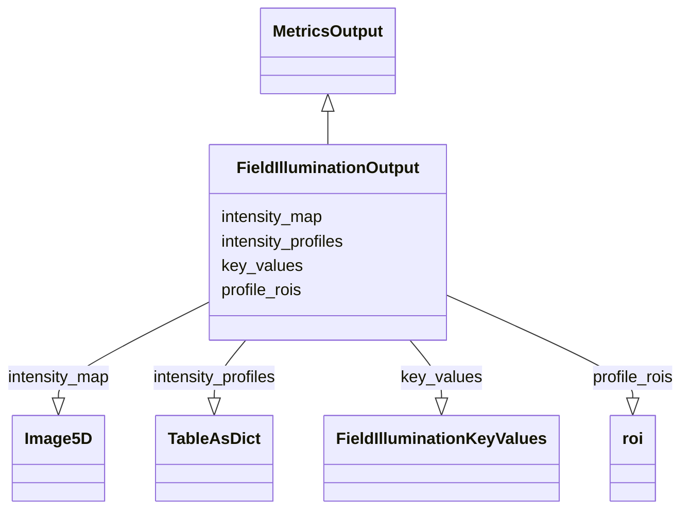

# Class: FieldIlluminationOutput


URI: [https://github.com/MontpellierRessourcesImagerie/microscope-metrics/blob/main/src/microscopemetrics/data_schema/samples/field_illumination_schema.yaml/:FieldIlluminationOutput](https://github.com/MontpellierRessourcesImagerie/microscope-metrics/blob/main/src/microscopemetrics/data_schema/samples/field_illumination_schema.yaml/:FieldIlluminationOutput)





## Inheritance
* [MetricsOutput](MetricsOutput.md)
    * **FieldIlluminationOutput**


## Slots

| Name | Cardinality and Range | Description | Inheritance |
| ---  | --- | --- | --- |
| [key_values](key_values.md) | 0..1 <br/> [FieldIlluminationKeyValues](FieldIlluminationKeyValues.md) | Key-Value pairs containing the Key measurements for the field illumination an... | direct |
| [intensity_profiles](intensity_profiles.md) | 0..1 <br/> [TableAsDict](TableAsDict.md) | Intensity profiles for the field illumination analysis in the different direc... | direct |
| [intensity_map](intensity_map.md) | 0..1 <br/> [Image5D](Image5D.md) | Intensity map of the field illumination | direct |
| [profile_rois](profile_rois.md) | 0..1 <br/> [Roi](Roi.md) | Output: ROIs used to compute the intensity profile | direct |


## Usages

| used by | used in | type | used |
| ---  | --- | --- | --- |
| [FieldIlluminationDataset](FieldIlluminationDataset.md) | [output](output.md) | range | [FieldIlluminationOutput](FieldIlluminationOutput.md) |


## Identifier and Mapping Information


### Schema Source


* from schema: https://github.com/MontpellierRessourcesImagerie/microscope-metrics/blob/main/src/microscopemetrics/data_schema/samples/field_illumination_schema.yaml


## Mappings

| Mapping Type | Mapped Value |
| ---  | ---  |
| self | https://github.com/MontpellierRessourcesImagerie/microscope-metrics/blob/main/src/microscopemetrics/data_schema/samples/field_illumination_schema.yaml/:FieldIlluminationOutput |
| native | https://github.com/MontpellierRessourcesImagerie/microscope-metrics/blob/main/src/microscopemetrics/data_schema/samples/field_illumination_schema.yaml/:FieldIlluminationOutput |


## LinkML Source

<!-- TODO: investigate https://stackoverflow.com/questions/37606292/how-to-create-tabbed-code-blocks-in-mkdocs-or-sphinx -->

### Direct

<details>
```yaml
name: FieldIlluminationOutput
from_schema: https://github.com/MontpellierRessourcesImagerie/microscope-metrics/blob/main/src/microscopemetrics/data_schema/samples/field_illumination_schema.yaml
is_a: MetricsOutput
attributes:
  key_values:
    name: key_values
    description: Key-Value pairs containing the Key measurements for the field illumination
      analysis
    from_schema: https://github.com/MontpellierRessourcesImagerie/microscope-metrics/blob/main/src/microscopemetrics/data_schema/samples/field_illumination_schema.yaml
    rank: 1000
    multivalued: false
    range: FieldIlluminationKeyValues
  intensity_profiles:
    name: intensity_profiles
    description: Intensity profiles for the field illumination analysis in the different
      directions
    from_schema: https://github.com/MontpellierRessourcesImagerie/microscope-metrics/blob/main/src/microscopemetrics/data_schema/samples/field_illumination_schema.yaml
    rank: 1000
    range: TableAsDict
  intensity_map:
    name: intensity_map
    description: Intensity map of the field illumination
    from_schema: https://github.com/MontpellierRessourcesImagerie/microscope-metrics/blob/main/src/microscopemetrics/data_schema/samples/field_illumination_schema.yaml
    rank: 1000
    multivalued: false
    range: Image5D
  profile_rois:
    name: profile_rois
    description: 'Output: ROIs used to compute the intensity profile'
    from_schema: https://github.com/MontpellierRessourcesImagerie/microscope-metrics/blob/main/src/microscopemetrics/data_schema/samples/field_illumination_schema.yaml
    rank: 1000
    multivalued: false
    range: roi

```
</details>

### Induced

<details>
```yaml
name: FieldIlluminationOutput
from_schema: https://github.com/MontpellierRessourcesImagerie/microscope-metrics/blob/main/src/microscopemetrics/data_schema/samples/field_illumination_schema.yaml
is_a: MetricsOutput
attributes:
  key_values:
    name: key_values
    description: Key-Value pairs containing the Key measurements for the field illumination
      analysis
    from_schema: https://github.com/MontpellierRessourcesImagerie/microscope-metrics/blob/main/src/microscopemetrics/data_schema/samples/field_illumination_schema.yaml
    rank: 1000
    multivalued: false
    alias: key_values
    owner: FieldIlluminationOutput
    domain_of:
    - FieldIlluminationOutput
    range: FieldIlluminationKeyValues
  intensity_profiles:
    name: intensity_profiles
    description: Intensity profiles for the field illumination analysis in the different
      directions
    from_schema: https://github.com/MontpellierRessourcesImagerie/microscope-metrics/blob/main/src/microscopemetrics/data_schema/samples/field_illumination_schema.yaml
    rank: 1000
    alias: intensity_profiles
    owner: FieldIlluminationOutput
    domain_of:
    - FieldIlluminationOutput
    range: TableAsDict
  intensity_map:
    name: intensity_map
    description: Intensity map of the field illumination
    from_schema: https://github.com/MontpellierRessourcesImagerie/microscope-metrics/blob/main/src/microscopemetrics/data_schema/samples/field_illumination_schema.yaml
    rank: 1000
    multivalued: false
    alias: intensity_map
    owner: FieldIlluminationOutput
    domain_of:
    - FieldIlluminationOutput
    range: Image5D
  profile_rois:
    name: profile_rois
    description: 'Output: ROIs used to compute the intensity profile'
    from_schema: https://github.com/MontpellierRessourcesImagerie/microscope-metrics/blob/main/src/microscopemetrics/data_schema/samples/field_illumination_schema.yaml
    rank: 1000
    multivalued: false
    alias: profile_rois
    owner: FieldIlluminationOutput
    domain_of:
    - FieldIlluminationOutput
    range: roi

```
</details>