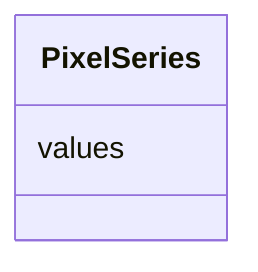

# Class: PixelSeries


_A series whose values represent pixels or voxels or a single integer defining the shape of the dimension_


URI: [https://github.com/MontpellierRessourcesImagerie/microscope-metrics/blob/main/src/microscopemetrics/data_schema/samples/field_illumination_schema.yaml/:PixelSeries](https://github.com/MontpellierRessourcesImagerie/microscope-metrics/blob/main/src/microscopemetrics/data_schema/samples/field_illumination_schema.yaml/:PixelSeries)





<!-- no inheritance hierarchy -->


## Slots

| Name | Cardinality and Range | Description | Inheritance |
| ---  | --- | --- | --- |
| [values](values.md) | 1..* <br/> [Integer](Integer.md) |  | direct |


## Usages

| used by | used in | type | used |
| ---  | --- | --- | --- |
| [ImageMask](ImageMask.md) | [y](y.md) | range | [PixelSeries](PixelSeries.md) |
| [ImageMask](ImageMask.md) | [x](x.md) | range | [PixelSeries](PixelSeries.md) |
| [Image2D](Image2D.md) | [y](y.md) | range | [PixelSeries](PixelSeries.md) |
| [Image2D](Image2D.md) | [x](x.md) | range | [PixelSeries](PixelSeries.md) |
| [Image5D](Image5D.md) | [z](z.md) | range | [PixelSeries](PixelSeries.md) |
| [Image5D](Image5D.md) | [y](y.md) | range | [PixelSeries](PixelSeries.md) |
| [Image5D](Image5D.md) | [x](x.md) | range | [PixelSeries](PixelSeries.md) |


## Identifier and Mapping Information


### Schema Source


* from schema: https://github.com/MontpellierRessourcesImagerie/microscope-metrics/blob/main/src/microscopemetrics/data_schema/samples/field_illumination_schema.yaml


## Mappings

| Mapping Type | Mapped Value |
| ---  | ---  |
| self | https://github.com/MontpellierRessourcesImagerie/microscope-metrics/blob/main/src/microscopemetrics/data_schema/samples/field_illumination_schema.yaml/:PixelSeries |
| native | https://github.com/MontpellierRessourcesImagerie/microscope-metrics/blob/main/src/microscopemetrics/data_schema/samples/field_illumination_schema.yaml/:PixelSeries |


## LinkML Source

<!-- TODO: investigate https://stackoverflow.com/questions/37606292/how-to-create-tabbed-code-blocks-in-mkdocs-or-sphinx -->

### Direct

<details>
```yaml
name: PixelSeries
implements:
- linkml:OneDimensionalSeries
description: A series whose values represent pixels or voxels or a single integer
  defining the shape of the dimension
from_schema: https://github.com/MontpellierRessourcesImagerie/microscope-metrics/blob/main/src/microscopemetrics/data_schema/samples/field_illumination_schema.yaml
attributes:
  values:
    name: values
    implements:
    - linkml:elements
    from_schema: https://github.com/MontpellierRessourcesImagerie/microscope-metrics/blob/main/src/microscopemetrics/data_schema/core_schema.yaml
    rank: 1000
    multivalued: true
    range: integer
    required: true

```
</details>

### Induced

<details>
```yaml
name: PixelSeries
implements:
- linkml:OneDimensionalSeries
description: A series whose values represent pixels or voxels or a single integer
  defining the shape of the dimension
from_schema: https://github.com/MontpellierRessourcesImagerie/microscope-metrics/blob/main/src/microscopemetrics/data_schema/samples/field_illumination_schema.yaml
attributes:
  values:
    name: values
    implements:
    - linkml:elements
    from_schema: https://github.com/MontpellierRessourcesImagerie/microscope-metrics/blob/main/src/microscopemetrics/data_schema/core_schema.yaml
    rank: 1000
    multivalued: true
    alias: values
    owner: PixelSeries
    domain_of:
    - PixelSeries
    - ChannelSeries
    - TimeSeries
    - Column
    range: integer
    required: true

```
</details>