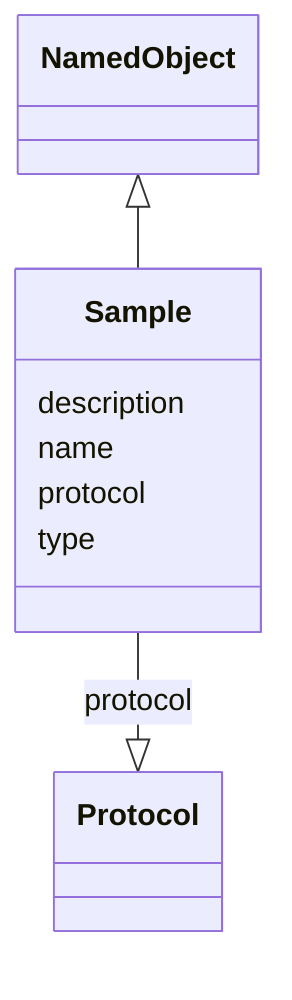

# Class: Sample


_A sample is a standard physical object that is imaged by a microscope_


URI: [https://github.com/MontpellierRessourcesImagerie/microscope-metrics/blob/main/src/microscopemetrics/data_schema/samples/argolight_schema.yaml/:Sample](https://github.com/MontpellierRessourcesImagerie/microscope-metrics/blob/main/src/microscopemetrics/data_schema/samples/argolight_schema.yaml/:Sample)





## Inheritance
* [NamedObject](NamedObject.md)
    * **Sample**


## Slots

| Name | Cardinality and Range | Description | Inheritance |
| ---  | --- | --- | --- |
| [type](type.md) | 1..1 <br/> [String](String.md) | The type of the sample | direct |
| [protocol](protocol.md) | 1..1 <br/> [Protocol](Protocol.md) | The protocol used to prepare the sample | direct |
| [name](name.md) | 0..1 <br/> [String](String.md) | The name of an entity | [NamedObject](NamedObject.md) |
| [description](description.md) | 0..1 <br/> [String](String.md) | A description of an entity | [NamedObject](NamedObject.md) |


## Usages

| used by | used in | type | used |
| ---  | --- | --- | --- |
| [ArgolightBDataset](ArgolightBDataset.md) | [sample](sample.md) | range | [Sample](Sample.md) |
| [ArgolightEDataset](ArgolightEDataset.md) | [sample](sample.md) | range | [Sample](Sample.md) |
| [MetricsDataset](MetricsDataset.md) | [sample](sample.md) | range | [Sample](Sample.md) |


## Identifier and Mapping Information


### Schema Source


* from schema: https://github.com/MontpellierRessourcesImagerie/microscope-metrics/blob/main/src/microscopemetrics/data_schema/samples/argolight_schema.yaml


## Mappings

| Mapping Type | Mapped Value |
| ---  | ---  |
| self | https://github.com/MontpellierRessourcesImagerie/microscope-metrics/blob/main/src/microscopemetrics/data_schema/samples/argolight_schema.yaml/:Sample |
| native | https://github.com/MontpellierRessourcesImagerie/microscope-metrics/blob/main/src/microscopemetrics/data_schema/samples/argolight_schema.yaml/:Sample |


## LinkML Source

<!-- TODO: investigate https://stackoverflow.com/questions/37606292/how-to-create-tabbed-code-blocks-in-mkdocs-or-sphinx -->

### Direct

<details>
```yaml
name: Sample
description: A sample is a standard physical object that is imaged by a microscope
from_schema: https://github.com/MontpellierRessourcesImagerie/microscope-metrics/blob/main/src/microscopemetrics/data_schema/samples/argolight_schema.yaml
is_a: NamedObject
attributes:
  type:
    name: type
    description: The type of the sample
    from_schema: https://github.com/MontpellierRessourcesImagerie/microscope-metrics/blob/main/src/microscopemetrics/data_schema/core_schema.yaml
    rank: 1000
    identifier: true
    range: string
    required: true
  protocol:
    name: protocol
    description: The protocol used to prepare the sample
    from_schema: https://github.com/MontpellierRessourcesImagerie/microscope-metrics/blob/main/src/microscopemetrics/data_schema/core_schema.yaml
    rank: 1000
    multivalued: false
    range: Protocol
    required: true
    inlined: false

```
</details>

### Induced

<details>
```yaml
name: Sample
description: A sample is a standard physical object that is imaged by a microscope
from_schema: https://github.com/MontpellierRessourcesImagerie/microscope-metrics/blob/main/src/microscopemetrics/data_schema/samples/argolight_schema.yaml
is_a: NamedObject
attributes:
  type:
    name: type
    description: The type of the sample
    from_schema: https://github.com/MontpellierRessourcesImagerie/microscope-metrics/blob/main/src/microscopemetrics/data_schema/core_schema.yaml
    rank: 1000
    identifier: true
    alias: type
    owner: Sample
    domain_of:
    - Sample
    range: string
    required: true
  protocol:
    name: protocol
    description: The protocol used to prepare the sample
    from_schema: https://github.com/MontpellierRessourcesImagerie/microscope-metrics/blob/main/src/microscopemetrics/data_schema/core_schema.yaml
    rank: 1000
    multivalued: false
    alias: protocol
    owner: Sample
    domain_of:
    - Sample
    range: Protocol
    required: true
    inlined: false
  name:
    name: name
    description: The name of an entity
    from_schema: https://github.com/MontpellierRessourcesImagerie/microscope-metrics/blob/main/src/microscopemetrics/data_schema/samples/argolight_schema.yaml
    rank: 1000
    multivalued: false
    alias: name
    owner: Sample
    domain_of:
    - NamedObject
    - Experimenter
    - Column
    range: string
    required: false
  description:
    name: description
    description: A description of an entity
    from_schema: https://github.com/MontpellierRessourcesImagerie/microscope-metrics/blob/main/src/microscopemetrics/data_schema/samples/argolight_schema.yaml
    rank: 1000
    multivalued: false
    alias: description
    owner: Sample
    domain_of:
    - NamedObject
    - Roi
    - Tag
    range: string

```
</details>